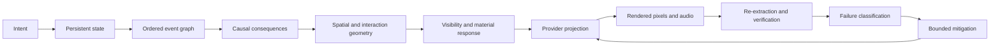

# Failure Cause Model

## Core model

CPCS should diagnose a failed video by locating the first broken contract in a layered chain:

The useful distinction is between **target representation failure**, **provider realization failure**, and **evaluator failure**:

- A target representation failure occurs when CPCS never encoded an identity, state, ordering, causal, spatial, visibility, support, or recovery obligation.
- A provider realization failure occurs when the obligation was encoded and compiled without loss but the generated artifact violates it.
- An evaluator failure occurs when the artifact and target are misclassified because the measurement or semantic judge cannot observe the relevant property.

A repair is unsafe until those three cases are separated. Adding prompt text cannot repair a missing tracker, and replacing a provider cannot repair a contradictory canonical score.

## Mechanism catalog

### Underdetermined hidden-state completion

**ID:** `mechanism://underdetermined_hidden_state`  
**Confidence:** high for the observable phenomenon; medium for closed-model internals  
**Evidence:** [B011], [B012], [B013], [B014], [B017]

When pixels cease to observe a subject or object, many latent continuations remain compatible with the visible frames and prompt. A generator without an externally enforced state trajectory may sample a plausible replacement rather than preserve the exact hidden state.

**Falsifiable prediction:** Continuity failure should rise with complete occlusion duration and recurrence distance, and fall when masks, point tracks, silhouettes, or explicit reappearance constraints bridge the hidden interval.

### Entity-binding and role ambiguity

**ID:** `mechanism://entity_binding_ambiguity`  
**Confidence:** high for the failure family; medium for any provider-specific causal attribution  
**Evidence:** [B002], [B015], [B017], [B019]

Text labels, visual appearance, screen location, and action roles can become competing identifiers. Similar actors, close contact, crossings, and cuts increase the chance that identity and role assignments are rebound.

**Falsifiable prediction:** Identity and role errors should increase with actor similarity and recurrence distance, while distinct identity signatures, stable screen lanes, separate references, and explicit role edges should reduce them.

### State representation gap

**ID:** `mechanism://state_representation_gap`  
**Confidence:** high as a control-system diagnosis; model-internal causality remains unverified  
**Evidence:** [B003], [B011], [B014], [B015], [R006]

A prose prompt usually describes desired events but does not carry a queryable ledger of identity, object count, possession, visibility, material state, and allowed transitions. The generator is therefore asked to infer persistence rather than obey an explicit state machine.

**Falsifiable prediction:** A state ledger plus transition assertions should improve state-transition agreement more than adding equivalent descriptive adjectives after controlling for prompt length.

### Coordinate-frame ambiguity

**ID:** `mechanism://coordinate_frame_ambiguity`  
**Confidence:** high  
**Evidence:** [B002], [R005], [R006]

Natural-language directions may refer to actor-relative, viewer-relative, camera-relative, or world-relative coordinates. Camera motion and edits change the screen projection without necessarily changing world geometry.

**Falsifiable prediction:** Explicit coordinate-frame declarations and shot-to-shot transforms should reduce left/right and axis errors compared with unqualified directional prose.

### Temporal dependency collapse

**ID:** `mechanism://temporal_dependency_collapse`  
**Confidence:** high for the observable pattern; provider thresholds require testing  
**Evidence:** [B003], [B010], [B017]

Multiple ordered actions, dependencies, and reactions compete for limited duration and conditioning capacity. The output may merge, omit, reorder, or make dependent events simultaneous.

**Falsifiable prediction:** Failure should rise with dependency depth and action density, while an explicit event graph or shot split should outperform equivalent compressed prose.

### No guaranteed physical constraint solver

**ID:** `mechanism://physical_constraint_absence`  
**Confidence:** high  
**Evidence:** [B004], [B005], [B006], [B025], [B026]

Current video generators can learn statistical regularities without enforcing conservation, support, collision, fluid response, or rigid-body constraints. Visual plausibility and physical correctness are therefore separable.

**Falsifiable prediction:** Prompt elaboration alone will plateau on interactions requiring precise contact, momentum, or material response; control media, decomposition, simulation, or postproduction will produce larger gains.

### Conditioning competition and priority dilution

**ID:** `mechanism://conditioning_competition`  
**Confidence:** medium; provider parsing behavior requires controlled tests  
**Evidence:** [R005], [M002], [M007]

Long, repetitive, contradictory, or multiply serialized instructions compete for influence. Providers may rewrite, truncate, or semantically compress prompts, and exact numerical fields may not map to explicit controllable variables.

**Falsifiable prediction:** After matching semantics, concise single-authority prompts should equal or outperform duplicated XML+JSON+YAML bundles on adherence per character, especially under provider prompt limits.

### Camera/scene-motion entanglement

**ID:** `mechanism://camera_scene_entanglement`  
**Confidence:** medium-high  
**Evidence:** [B021], [R004], [R006]

Observed optical flow is a mixture of camera motion, actor motion, deforming effects, and edits. A generative model may satisfy a camera instruction by moving the scene or subject instead of reproducing the intended world-space trajectory.

**Falsifiable prediction:** Separating camera and actor tracks, or holding one constant, should reduce trajectory drift and identity deformation compared with combined complex instructions.

### Graphic discontinuity conflated with world-state change

**ID:** `mechanism://graphic_world_state_conflation`  
**Confidence:** medium-high  
**Evidence:** [B010], [B017], [R005]

Flashes, smears, wipes, speed lines, and blur are both visual effects and potential shot boundaries. Without an explicit continuity contract, the model may treat a graphic discontinuity as permission to reset identity, anatomy, style, or geography.

**Falsifiable prediction:** A required post-effect recovery frame and explicit 'graphic-only; world state unchanged' assertion should reduce scene-reset errors, with stronger gains from first/last frames or reference keyframes.

### Evaluator observability gap

**ID:** `mechanism://evaluator_observability_gap`  
**Confidence:** high  
**Evidence:** [B007], [B008], [B009], [B017], [B018], [B019], [B020], [B021], [B025]

A single VLM or detector may miss fast events, hallucinate contact, swap tracks, misclassify flashes as cuts, or fail on stylized anatomy. Evaluation therefore needs multiple independent lanes plus preserved conflicts and human calibration.

**Falsifiable prediction:** Disagreement will concentrate in short contact intervals, full occlusions, fast motion, reflections, and stylized frames; multi-lane adjudication will reduce false certainty rather than necessarily increase pass rate.

## Diagnostic decision sequence

1. **Validate canonical completeness.** Are actor IDs, counts, state transitions, event dependencies, coordinate frames, visibility intervals, causal origins, support/contact obligations, terminal state, and verification assertions present?
2. **Validate compiler fidelity.** Did the provider projection retain every hard lock and report unsupported/evaluation-only controls instead of silently dropping them?
3. **Validate provider capability.** Does the exact model/version/interface officially accept the required carrier: first/last frames, multiple references, masks, keyframes, trajectory, source video, audio, or edit instruction?
4. **Localize first divergence.** Identify the earliest frame/interval where state or event evidence departs from the target.
5. **Challenge the evaluator.** Re-run with a second lane and human review if fast motion, occlusion, reflection, stylization, camera geometry, or screen-overlap contact is involved.
6. **Choose the minimum sufficient mitigation.** Wording only for lexical ambiguity; structured contract for missing state; visual controls for unobserved trajectories/geometry; decomposition for density; postproduction for deterministic effects; provider substitution only after capability mismatch is established.
7. **Re-verify all hard locks.** Localized repair can create collateral damage outside the edited concept or interval.

## Why negative prompting is insufficient

A negative prompt can discourage visible concepts, but it does not provide the positive state trajectory that must occupy an ambiguous interval. “No duplicate,” “no teleport,” and “do not change clothing” identify forbidden outcomes; they do not specify which latent pose, path, count, material state, or reappearance region should persist. Negative constraints therefore belong in the contract, but the contract must also include a positive continuation and an observable verification method.
