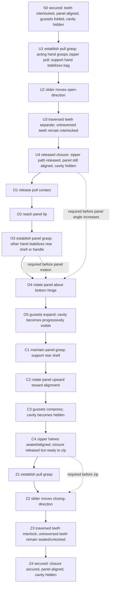

# AI Video Directing For Causal Human-Object Manipulation

Case study: bimanual opening and closing of a zippered bag.

Research question: How should an AI video directing system represent, prompt, and verify causal human-object manipulation sequences, without treating unzipping as equivalent to opening the bag panel?

Date scoped: 2026-08-09.

## Executive Answer

The system should represent the bag task as a sequence of state-changing events over object parts, contacts, and visibility, not as a single text phrase such as "open the bag." The crucial split is:

- UNZIP changes zipper-tooth closure state locally along the path swept by the slider.
- OPEN changes panel angle after a hand releases the zipper pull, reaches/regrasps the panel lip, and the other hand stabilizes an anchored part.
- CLOSE reverses panel motion and gusset expansion before zipping.
- ZIP re-secures already seated zipper halves by moving the slider in the closing direction.

Evidence labels used below:

- Source evidence: directly stated by a source.
- Source-linked inference: a consequence of source evidence applied to this case.
- Directing choice: a representation or prompt design choice for generation control.
- Provider-specific compromise: a tactic constrained by a specific provider or model interface.
- Untested hypothesis: a plausible but unproven prompt or serialization effect requiring experiment.

## 1. Source Table

| Supported claim | Source locator | Evidence class | Relevance to directing |
|---|---|---:|---|
| A zipper has two rows of teeth on tape; the slider draws teeth together and joins or separates elements when opened or closed. | YKK Americas, "The Structure of a Zipper", lines 62-68, https://ykkamericas.com/the-structure-of-a-zipper/ | Source evidence | Treat slider motion as a local closure-state operation, not panel rotation. |
| Zipper teeth/elements mesh with the other side when passed through the slider; engaged left/right teeth form a chain. | YKK Americas, lines 67-68, https://ykkamericas.com/the-structure-of-a-zipper/ | Source evidence | The "passed region" behind a closing slider can be marked interlocked; the region ahead remains in its prior state. |
| Closing can fail when stringers/elements enter the slider at improper angles or without being pulled closely together. | YKK Usage Instruction Manual, p.32, lines 846-857, https://ykkamericas.com/wp-content/uploads/2021/10/ykk-zipper-instruction-manual-compressed.pdf | Source evidence | ZIP requires seated/aligned zipper halves before slider motion; "zip while panel is misaligned" is invalid. |
| Coil zipper stringers can stretch and differing element pitch can curve/unbalance the chain. | YKK Usage Instruction Manual, p.31, lines 820-829 | Source evidence | Flex and deformation are product/material-specific; avoid overfitting the model to a perfectly rigid zipper. |
| Side gusset pouches use expandable side panels to increase internal volume. | Eagle Flexible Packaging, "Side Gusset Pouch Options", https://www.eagleflexible.com/products/preformed-pouches/side-gusset-pouch/ | Source evidence | Gusset expansion should follow panel displacement, not precede it. |
| Bag anatomy distinguishes panels and gussets; gussets connect front/back panels and bottom and give depth/volume. | Arsutoria School, "The Essential Vocabulary of Bag Construction and Anatomy", Bag Anatomy section, https://www.arsutoriaschool.com/the-essential-vocabulary-of-bag-construction-and-anatomy/ | Source evidence | Directing should name front panel, rear shell/panel, bottom hinge/base, side gussets, and zipper halves separately. |
| Skilled bimanual activity often uses two hands in different roles rather than interchangeable hands. | Guiard 1987, PDF lines 11-24 and 115-129, https://www.lri.fr/~mbl/ENS/FONDIHM/2013/papers/Guiard-JMB87.pdf | Source evidence | Maintain acting-hand and supporting-hand roles across frames and cuts. |
| Manipulation means applying motions or forces to purposefully change object state; manipulation primitives include sliding, pivoting, rolling, toppling, etc. | Modern Robotics, "Grasping and Manipulation", lines 32-37, https://modernrobotics.northwestern.edu/nu-gm-book-resource/grasping-and-manipulation/ | Source evidence | "Panel rotates" requires a contact/force path and an articulated part, not just visual displacement. |
| Contact modes label contact as sliding, rolling/sticking, or breaking free. | Modern Robotics Chapter 12, lines 39-48; 12.1.3 lines 29-37, https://modernrobotics.northwestern.edu/chapters/chapter12/ | Source evidence | Represent hand-object contact as a mode state, not a vague proximity. |
| Regrasp planners search sequences of grasps and motions from initial to goal states. | Wan et al., "Integrated assembly and motion planning using regrasp graphs", lines 236-272, https://link.springer.com/article/10.1186/s40638-016-0050-2 | Source evidence | Release/reach/regrasp is a necessary observable transition when a hand changes object part. |
| Contact-rich skills benefit from explicit precondition functions that predict whether a skill execution can succeed. | Liang et al. 2023, PMLR PDF lines 45-56 and 58-84, https://proceedings.mlr.press/v205/liang23a/liang23a.pdf | Source evidence | Each event should carry preconditions and postconditions. |
| PDDL-style planning uses preconditions and postconditions/effects to describe action applicability and consequences. | Fox & Long, PDDL2.1 JAIR PDF, p.3 excerpt: "pre- and post-conditions", https://www.jair.org/index.php/jair/article/download/10352/24759/19128 | Source evidence | Event schemas should include applicability and state effects. |
| Hand-object contact is a measurable computer-vision object of study; ContactPose pairs contact, hand pose, object pose, and RGB-D grasp images. | Meta AI ContactPose, lines 14-16, https://ai.meta.com/research/publications/contactpose-a-dataset-of-grasps-with-object-contact-and-hand-pose/ | Source evidence | Verification should score contact, hand pose, object identity, and grasp region. |
| Sora-like video systems can maintain some object persistence but have simulator limitations, including faulty physics/state changes and spontaneous objects. | OpenAI "Video generation models as world simulators", lines 108-123, https://openai.com/index/video-generation-models-as-world-simulators/ | Source evidence | Do not claim text prompts guarantee contact, anatomy, or physical state transitions. |
| OpenAI video prompting guidance asks for shot type, subject, action, setting, lighting; references and extensions can help iteration/continuity. | OpenAI Video Generation guide, lines 774-780 and 940-946, https://developers.openai.com/api/docs/guides/video-generation | Source evidence | Compile event graphs into shot-level prompts with camera, subject, action, and visual state. |
| OpenAI Sora 2 API was marked deprecated with shutdown on 2026-09-24. | OpenAI Video Generation guide, lines 768-769 | Provider-specific compromise | Treat OpenAI video evidence as model/version/date scoped. |
| Google Veo prompting guide recommends specifying framing/motion, style, lighting, character, location, and action. | Google DeepMind Veo prompt guide, lines 133-157, https://deepmind.google/models/veo/prompt-guide/ | Source evidence | Prompt templates should include action and camera fields, but the causal model should stay provider-neutral. |
| Google Cloud best practices recommend clear, direct, specific prompts and high-quality source images for image-to-video. | Google Cloud best practices, lines 497-503 and 597-600, https://docs.cloud.google.com/gemini-enterprise-agent-platform/models/video/best-practice | Source evidence | Reference media can reduce ambiguity but remains empirical. |
| Google Veo reference images can preserve subject appearance for a person, character, or product. | Google Cloud reference-image guide, lines 492-506, https://docs.cloud.google.com/gemini-enterprise-agent-platform/models/video/use-reference-images-to-guide-video-generation | Source evidence | Object reference images may help maintain bag identity. |
| Runway Gen-4 image-to-video uses an input image as the visual starting point and asks prompts to focus on desired motion. | Runway Gen-4 guide, lines 89-94 and 58-64, https://help.runwayml.com/hc/en-us/articles/39789879462419-Gen-4-Video-Prompting-Guide | Source evidence | Use first-frame references and motion-focused prompts for object-specific phases. |
| Runway Gen-4 supports 5 or 10 second durations; complex multiple movements benefit from longer clips. | Runway Creating with Gen-4 Video, lines 71-82, https://help.runwayml.com/hc/en-us/articles/37327109429011-Creating-with-Gen-4-Video | Provider-specific compromise | Keep each phase short; do not cram unzip, transfer, open, close, and zip into one clip. |
| VBench evaluates video generation along dimensions including subject identity inconsistency, motion smoothness, temporal flickering, and spatial relationship. | VBench project page, lines 15-26, https://vchitect.github.io/VBench-project/ | Source evidence | General video quality metrics are useful but insufficient for zipper-specific causal verification. |
| PhyGenBench finds current T2V models struggle with physical commonsense; scaling and prompt engineering alone are insufficient for dynamic scenarios. | PMLR ICML 2025 PhyGenBench, lines 14-17 and 24-27, https://proceedings.mlr.press/v267/meng25c.html | Source evidence | Prompt structure can reduce failures; it cannot certify physics. |

## 2. Mechanism And State Vocabulary

### Mechanically Established Facts

- Source evidence: A zipper slider joins or separates teeth/elements as it moves along two rows of zipper tape.
- Source-linked inference: In a normal single-slider zipper, closure state changes only at and behind the moving slider. The region ahead of the slider in its direction of travel retains its previous state until the slider reaches it.
- Source-linked inference: During UNZIP from a secured state, traversed teeth become separated/released; untraversed teeth remain interlocked.
- Source-linked inference: During ZIP from an aligned released state, traversed teeth become interlocked/secured; untraversed teeth remain separated but seated/aligned.
- Source evidence: Closing requires the two zipper sides/stringers to enter the slider in proper alignment; forcing misaligned halves can mis-engage elements.

### Product-Specific Assumptions For This Case

- Directing choice: The main panel opens by rotating about a bottom hinge or flexible bottom edge.
- Directing choice: Side gussets unfold during opening and fold/compress during closing.
- Source-linked inference: The cavity becomes visible as panel angle and gusset volume increase, not merely because the zipper was released.
- Product-specific: Exact gusset fold pattern, hinge stiffness, zipper type, slider lock, number of sliders, and panel deformation require reference media or product inspection.

### Core States

| State field | Values | Notes |
|---|---|---|
| `closure_state` | `secured`, `partly_released`, `released`, `aligned_unsecured`, `misaligned` | Closure state is not panel openness. |
| `tooth_segment_state` | `interlocked`, `separated`, `seated_unlocked`, `transition_under_slider`, `unknown_occluded` | Segment-level state supports frame verification. |
| `panel_state` | `aligned_closed`, `released_aligned`, `opening`, `open`, `closing`, `aligned_for_zip` | Panel state is driven by panel contact and hinge rotation. |
| `panel_angle_deg` | numeric | 0 means aligned/closed. Visibility should increase only after a nonzero angle. |
| `gusset_state` | `folded`, `expanding`, `expanded`, `compressing` | Coupled to panel angle. |
| `cavity_visibility` | `hidden`, `sliver`, `partial`, `visible` | Visibility consequence, not an action. |
| `hand_contact` | `none`, `hover`, `touch`, `grasp`, `sliding_contact`, `released` | Must be per hand and per object part. |
| `hand_role` | `acting`, `supporting`, `idle`, `transitioning` | Roles can switch only through visible transfer events. |

## 3. Causal Event Graph



### Event Dependency Rules

| Rule | Label | Explanation |
|---|---:|---|
| `panel_angle_deg > 0` requires `closure_state in {released, aligned_unsecured}` and `front_panel.grasp == established`. | Source-linked inference + directing choice | Prevents unzipping from acting as opening. |
| `cavity_visibility != hidden` requires `panel_angle_deg > threshold`. | Source-linked inference | Prevents cavity reveal before physical displacement. |
| `zipper_slider.velocity != 0` requires `pull.grasp == established`. | Source-linked inference | Prevents slider teleporting or self-moving. |
| `ZIP` requires zipper halves `seated_unlocked` or `aligned_for_zip`. | Source-linked inference | Prevents closure securing while panel is displaced. |
| Hand contact transfer requires visible release, reach, and regrasp states. | Source evidence + directing choice | Prevents hand teleportation. |
| Support hand anchors rear shell/handle during panel rotation. | Source-linked inference | Bimanual support gives a reference frame for controlled panel motion. |

## 4. Reusable Contact-State Model

```yaml
model: bimanual_articulated_object_v1
entities:
  actors:
    - id: hand_L
      identity_markers: [side, sleeve, approximate_pose]
    - id: hand_R
      identity_markers: [side, sleeve, approximate_pose]
  object_parts:
    - zipper_pull
    - zipper_slider
    - zipper_left_half
    - zipper_right_half
    - tooth_segments[]
    - front_panel
    - rear_shell
    - bottom_hinge
    - side_gussets
    - cavity
state:
  contacts:
    - hand: hand_L
      part: zipper_pull
      mode: none | hover | touch | grasp | sliding_contact | released
      patch: null | bounding_region
      confidence: 0.0-1.0
    - hand: hand_R
      part: rear_shell
      mode: none | touch | grasp | brace
  kinematics:
    slider_position: normalized_0_to_1
    slider_direction: opening | closing | none
    panel_angle_deg: number
    hinge_axis: bottom_edge | side_edge | product_specific
  closure:
    closure_state: secured | partly_released | released | aligned_unsecured | misaligned
    tooth_segments:
      - id: seg_001
        state: interlocked | separated | seated_unlocked | transition_under_slider | unknown_occluded
  visibility:
    cavity_visibility: hidden | sliver | partial | visible
    occlusions:
      - by: hand_L
        hides: zipper_slider
constraints:
  hard_invariants:
    - cavity_visibility_can_increase_only_after_panel_angle_increases
    - panel_rotation_requires_established_panel_contact
    - zipper_slider_motion_requires_pull_contact
    - secured_closure_blocks_panel_opening
  phase_local_prohibitions:
    unzip:
      - forbid_panel_rotation
      - forbid_cavity_reveal
    open:
      - forbid_slider_motion
      - require_release_reach_regrasp_before_rotation
    close:
      - forbid_slider_motion_until_panel_aligned
    zip:
      - forbid_panel_rotation
      - require_halves_seated_before_slider_closing
  soft_preferences:
    - locked_or_slow_camera_for_contact_verification
    - keep both hands visible during contact transfer
    - use reference image for bag identity and zipper geometry
```

## 5. Phase Template For Closures

Use this for bags, suitcases, jackets, lids, flaps, doors, cases, and hinged covers.

```yaml
phase_template:
  phase_id: string
  closure_type: zipper | latch | snap | magnet | hinge | buckle | drawstring | other
  initial_state:
    closure: secured | released | aligned_unsecured | misaligned
    moving_part: aligned | displaced | open
    interior_visibility: hidden | partial | visible
  actors:
    acting_hand:
      start_contact: part
      end_contact: part
      visible_transfer_required: true
    support_hand:
      anchor_part: part
      role: stabilize | brace | counter-pull | hold-open
  positive_sequence:
    - establish_contact
    - apply_motion
    - observe_progressive_state_change
    - settle_postcondition
  hard_invariants:
    - object_state_changes_only_from_valid_contacts_or_mechanisms
    - visibility_follows_geometry
    - no part moves through another part
  phase_local_prohibitions:
    - scoped_negative_constraint
  controlled_degrees_of_freedom:
    camera: locked | pan | dolly | closeup
    duration_seconds: number
    allowed_occlusion: none | brief | specified
  postconditions:
    closure: secured | released | aligned_unsecured
    moving_part: aligned | open
    interior_visibility: hidden | visible
  verification:
    frame_observables:
      - contact_patch
      - moving_part_angle
      - closure_local_state
      - interior_visibility
```

## 6. Prompt Compiler Checklist

Compile from event graph to timed shots:

1. Choose phase granularity.
   - Directing choice: One clip should contain one main causal state change or one contact transfer.
   - For this bag, use four main clips: UNZIP, OPEN, CLOSE, ZIP.

2. Freeze the object reference.
   - Use a high-quality reference image or first frame showing the same bag, zipper path, pull, front panel, rear shell, side gussets, and hinge edge.
   - Provider-specific compromise: On Runway Gen-4, the input image is the first frame, so focus the text on motion. On Google Veo, test subject/product references where available. On OpenAI Sora 2, note the API deprecation and model/version date.

3. Write start and end state for each shot.
   - Bad: "Open the zippered bag."
   - Better: "Start with the front panel aligned and cavity hidden. End with only the zipper teeth along the slider path separated; the front panel remains aligned."

4. Declare acting/supporting roles.
   - "Right hand grasps zipper pull and moves it left to right; left hand braces the rear shell."

5. Add contact transfer explicitly.
   - "The right hand releases the zipper pull, moves to the front panel lip, then visibly grasps the lip before pulling the panel outward."

6. Scope negative constraints by phase.
   - UNZIP: forbid panel rotation and cavity visibility.
   - TRANSFER: permit release, reach, and regrasp.
   - OPEN: forbid zipper slider motion.
   - ZIP: forbid panel rotation; require zipper halves seated.

7. Avoid blanket negatives that block required motion.
   - Bad: "Hands never change grip, no hand movement, no object deformation."
   - Why bad: OPEN requires a hand to change grip and gussets to deform.

8. Select camera for verifiability.
   - Prefer close, locked, 3/4 front angle for zipper and panel phases.
   - Use wider framing only when both hands, hinge, and cavity must be visible.

9. Limit temporal density.
   - Keep contact transfer and panel rotation separate if the model tends to skip regrasp.
   - Provider-specific compromise: use 5-10 second clips for single actions; longer only if the provider supports stable longer clips.

10. Generate candidates and verify frame-observable checks.
   - Do not accept a clip because it "looks plausible" if a hidden transition violates the event graph.

## 7. Failure-Card Matrix

| Symptom | Broken dependency | Likely prompt cause | Repair | Observable verification test |
|---|---|---|---|---|
| Panel opens during UNZIP. | Panel rotation requires released closure and panel grasp. | "Unzip/open" conflated. | Split UNZIP and OPEN; forbid panel motion during UNZIP. | Panel angle stays near 0 until UNZIP ends. |
| Cavity appears before panel moves. | Visibility follows panel angle/gusset expansion. | Prompt asks to "reveal inside" too early. | Move reveal text to OPEN only. | Interior pixels appear only after panel angle increases. |
| Teeth change ahead of slider. | Closure changes only in traversed region. | Prompt says entire zipper opens instantly. | Add "only the teeth passed by the slider separate." | Ahead-of-slider teeth remain in prior state. |
| Slider moves without hand contact. | Slider motion requires pull grasp. | Camera hides pull; prompt omits grip. | Start with visible pull grasp. | Finger/pull contact is visible before and during slider motion. |
| Hand teleports from pull to panel. | Contact transfer requires release, reach, regrasp. | Shot too dense; prompt omits transfer. | Add transfer shot. | Frames show release -> empty space/reach -> panel contact. |
| Panel rotates without grasp. | Panel rotation requires established panel contact. | Prompt says panel "swings open" passively. | Require hand on panel lip before rotation. | Contact patch remains on panel lip during rotation. |
| Support hand disappears or swaps identity. | Bimanual roles must persist. | Prompt labels only "a hand." | Label left/right roles and keep sleeves/positions visible. | Hand count and side identity consistent frame to frame. |
| Hand penetrates fabric or zipper. | Contact geometry invalid. | Close-up under-specified; no reference. | Use reference image, slower motion, locked camera. | Finger surfaces remain outside bag surface except valid contact. |
| Hand slides while supposedly gripping. | Grasp/contact mode inconsistent. | Prompt says "pulls" but contact patch changes freely. | Specify "steady pinch grasp on pull/lip." | Contact patch moves with object part, not across it. |
| Zipper pull detaches or morphs. | Object identity/part continuity broken. | Tiny pull, low detail, large camera move. | Close crop; reference frame; verify pull visibility. | Pull remains attached to slider across frames. |
| Gussets stay flat while cavity opens. | Panel displacement should expand side volume. | Prompt ignores gussets. | Add "side gussets unfold as panel rotates." | Side folds widen after panel angle increases. |
| ZIP happens while panel is open. | ZIP requires seated/aligned halves. | Prompt skips CLOSE. | Add CLOSE phase before ZIP. | Panel angle near 0 and zipper halves adjacent before slider closing. |
| Cut hides invalid transition. | Continuity state across cuts missing. | Multi-shot prompt lacks carryover state. | Write end-state/start-state handoff and reject discontinuities. | First frame of shot N+1 matches last frame of shot N. |
| Extra/fused/duplicated hands. | Hand count/identity invariant broken. | Hand anatomy under-specified; occluded interaction. | Use simpler camera, fewer simultaneous actions, post-select. | Exactly two human hands with stable identity and plausible digits. |
| Object morphs into a different bag. | Object identity invariant broken. | No reference; style prompt dominates. | Reference image; object identity checks; reduce style adjectives. | Same zipper path, panel shape, color, gussets across frames. |

## 8. Provider-Neutral Structured Example

Canonical YAML:

```yaml
sequence_id: zippered_bag_open_close_v1
object:
  type: soft_structured_bag
  parts:
    front_panel: { moves: true, hinge: bottom_hinge }
    rear_shell: { anchored_by: support_hand }
    zipper: { parts: [left_half, right_half, slider, pull, tooth_segments] }
    side_gussets: { coupled_to: front_panel_angle }
    cavity: { visible_when: panel_angle_deg > 12 }
actors:
  right_hand: { initial_role: acting }
  left_hand: { initial_role: supporting }
global_hard_invariants:
  - no_panel_rotation_while_closure_secured
  - no_cavity_visibility_before_panel_displacement
  - zipper_slider_moves_only_while_pull_is_grasped
  - hand_identity_and_count_remain_continuous
phases:
  - id: UNZIP
    duration_suggestion: 4-6
    preconditions:
      closure_state: secured
      panel_state: aligned_closed
      cavity_visibility: hidden
      right_hand_contact: zipper_pull_grasp
      left_hand_contact: rear_shell_brace
    action:
      actor: right_hand
      target: zipper_slider
      trajectory: along_zipper_track_opening_direction
      affected_region: tooth_segments_passed_by_slider
      unchanged_region: unpassed_tooth_segments_and_panel
    progressive_change:
      passed_teeth: interlocked -> separated
      panel_angle_deg: remains_0
      cavity_visibility: remains_hidden
    postconditions:
      closure_state: released
      panel_state: released_aligned
    phase_local_prohibitions:
      - forbid_panel_rotation
      - forbid_cavity_reveal
  - id: CONTACT_TRANSFER
    duration_suggestion: 2-4
    preconditions:
      closure_state: released
      right_hand_contact: zipper_pull_grasp
    action_sequence:
      - right_hand releases zipper_pull
      - right_hand reaches front_panel_lip
      - right_hand establishes_grasp front_panel_lip
    postconditions:
      right_hand_contact: front_panel_lip_grasp
    phase_local_permissions:
      - permit_release
      - permit_reach
      - permit_regrasp
  - id: OPEN
    duration_suggestion: 4-6
    preconditions:
      closure_state: released
      right_hand_contact: front_panel_lip_grasp
      left_hand_contact: rear_shell_brace
      panel_state: released_aligned
    action:
      actor: right_hand
      target: front_panel
      trajectory: rotate_outward_about_bottom_hinge
      anchored_region: rear_shell_and_bottom_hinge
    progressive_change:
      panel_angle_deg: 0 -> 60
      side_gussets: folded -> expanding -> expanded
      cavity_visibility: hidden -> sliver -> partial -> visible
    postconditions:
      panel_state: open
      cavity_visibility: visible
    phase_local_prohibitions:
      - forbid_zipper_slider_motion
  - id: CLOSE
    duration_suggestion: 4-6
    preconditions:
      panel_state: open
      right_hand_contact: front_panel_lip_grasp
      left_hand_contact: rear_shell_brace
    action:
      actor: right_hand
      target: front_panel
      trajectory: rotate_upward_to_alignment_about_bottom_hinge
    progressive_change:
      panel_angle_deg: 60 -> 0
      side_gussets: expanded -> compressing -> folded
      cavity_visibility: visible -> partial -> hidden
    postconditions:
      panel_state: aligned_for_zip
      closure_state: aligned_unsecured
      zipper_halves: seated_unlocked
    phase_local_prohibitions:
      - forbid_zipper_slider_motion_until_panel_aligned
  - id: ZIP
    duration_suggestion: 4-6
    preconditions:
      panel_state: aligned_for_zip
      closure_state: aligned_unsecured
      zipper_halves: seated_unlocked
      right_hand_contact: zipper_pull_grasp
    action:
      actor: right_hand
      target: zipper_slider
      trajectory: along_zipper_track_closing_direction
      affected_region: tooth_segments_passed_by_slider
      unchanged_region: unpassed_seated_unlocked_segments_and_panel
    progressive_change:
      passed_teeth: seated_unlocked -> interlocked
      panel_angle_deg: remains_0
      cavity_visibility: remains_hidden
    postconditions:
      closure_state: secured
      panel_state: aligned_closed
      cavity_visibility: hidden
```

Natural-language projection:

> Locked close-up of the same zippered bag. The left hand braces the rear shell. The right hand pinches the zipper pull and moves the slider along the zipper track in the opening direction. Only the teeth already passed by the slider separate; the teeth ahead of the slider remain interlocked. The front panel stays aligned and does not rotate; the cavity remains hidden.

XML projection:

```xml
<phase id="UNZIP">
  <preconditions closure="secured" panel="aligned_closed" cavity="hidden"/>
  <contact hand="right" part="zipper_pull" mode="grasp"/>
  <contact hand="left" part="rear_shell" mode="brace"/>
  <action actor="right_hand" target="zipper_slider" trajectory="opening_direction"/>
  <effect region="passed_teeth" from="interlocked" to="separated"/>
  <invariant field="panel_angle_deg" value="0"/>
  <invariant field="cavity_visibility" value="hidden"/>
  <postconditions closure="released" panel="released_aligned"/>
</phase>
```

## 9. Frame-Observable Verification Checklist

Score each item per keyframe and across adjacent frames. Use `pass`, `fail`, or `occluded_unknown`; reject if a hard invariant is `fail`.

| Observable | What to check | Reject condition |
|---|---|---|
| Slider position | Slider follows zipper track in the named direction. | Slider jumps, detaches, or moves without pull contact. |
| Local tooth state | During UNZIP, passed region separates and ahead region stays interlocked; during ZIP, passed region interlocks and ahead region remains seated/unlocked. | Teeth change globally or ahead of slider. |
| Hand contact | Acting hand has the specified contact before applying motion. | Object part moves before contact is established. |
| Hand transfer | Release, reach, and regrasp are visible or explicitly carried across a cut. | Hand appears on new part without transition or continuity state. |
| Panel angle | Panel angle remains near 0 during UNZIP/ZIP and changes only during OPEN/CLOSE. | Panel opens during UNZIP or ZIP. |
| Gusset state | Gussets expand with increasing panel angle and compress with decreasing panel angle. | Gussets expand before panel motion or remain flat while cavity opens. |
| Cavity visibility | Hidden until panel angle exceeds threshold; progressively visible during OPEN. | Cavity visible while panel remains aligned. |
| Hand count/anatomy | Exactly two visible hands where expected; no fused, duplicated, or vanishing fingers that alter contact. | Extra hand/fused hand drives action or breaks contact proof. |
| Object identity | Same bag, zipper path, pull, panel, gussets across frames and cuts. | Object changes shape or zipper relocates. |
| Continuity across cuts | Shot N end state matches shot N+1 start state for closure, panel angle, hand contacts, and visibility. | Cut hides a causally required transition. |

## 10. Provider- And Model-Scoped Experiment Plan

Goal: separate evidence about causal content from evidence about serialization format.

### Providers And Model Scope

Use exact provider/model/date labels in every result row. As of sources checked on 2026-08-09:

- OpenAI: Sora 2 / Sora 2 Pro API documentation exists, but the docs state deprecation and shutdown on 2026-09-24. Treat any result as time-limited and model-version-specific.
- Google: Gemini API video generation distinguishes Gemini Omni Flash and Veo 3.1; Google docs state Omni Flash as default for video generation and Veo 3.1 for extension, last-frame control, and legacy pipeline needs.
- Runway: Gen-4 documentation exists but marks Gen-4 as older and points to Gen-4.5 for current text/image-to-video workflows; Gen-4 image-to-video requires an input image and supports 5 or 10 second clips.

### Single-Variable Comparisons

| Experiment | Control | Variant | Hold constant | Measures |
|---|---|---|---|---|
| Serialization format | Natural-language prompt | Same content in YAML or XML projection | Events, wording content, duration, model, seed when supported | Causal verification score; do not credit format unless content identical. |
| Phase segmentation | One full 20s or max-supported prompt | Four phase-specific clips | Same event graph | Skipped transfer rate; invalid panel/cavity timing. |
| Reference media | Text-only | First-frame or object reference image | Prompt text, duration | Object identity, zipper path stability, hand-object penetration. |
| Scoped constraints | Blanket negative prompt | Phase-local prohibitions | Positive sequence | Required action blockage, skipped regrasp, panel motion errors. |
| Camera | Wide handheld | Locked close 3/4 view | Event content | Observable contact score, occlusion rate. |
| Duration | Shortest supported clip | Longer supported clip | Event content | Completion vs rushing; extra hallucinated motion. |
| Contact transfer | Omitted transfer | Explicit release-reach-regrasp shot | Same open action | Teleport/regrasp failure rate. |
| Hand role labels | "Hands open bag" | "Right hand acts; left hand braces" | Same shot | Hand identity swaps, support loss. |
| Start/end state text | Action-only | Start-state and end-state specified | Same model/duration | Closure/panel/cavity sequencing failures. |

### Evaluation Protocol

1. Generate at least 20 samples per condition per provider/model/version, or the maximum economically feasible count.
2. Randomize condition order; log prompt, reference assets, model ID, provider settings, seed, duration, aspect ratio, date, and output ID.
3. Score with the frame-observable checklist before judging aesthetics.
4. Separate hard-fail rate from soft quality preferences.
5. Label conclusions:
   - Source evidence: provider docs or paper results.
   - Source-linked inference: event-graph conclusions derived from mechanism/contact sources.
   - Directing choice: selected template or camera convention.
   - Provider-specific compromise: feature or duration constraint.
   - Untested hypothesis: any claim that YAML, XML, negative prompting, or references improve physical correctness until isolated tests support it.

## Final Design Rules

- Do not use "unzip" as a synonym for "open."
- Do not use "released," "open," and "visible" interchangeably.
- Represent slider motion, panel contact transfer, panel rotation, gusset expansion, and cavity reveal as separate causal events.
- Treat negative constraints as scoped. A blanket "no hand changes" can block the required release/regrasp.
- Use references, short phases, locked camera, and post-generation selection to reduce failures, but do not claim they guarantee exact hand anatomy or contact physics.
- Verify what is visible at frame level, especially local tooth state, hand contact, panel angle, gusset state, and continuity across cuts.
