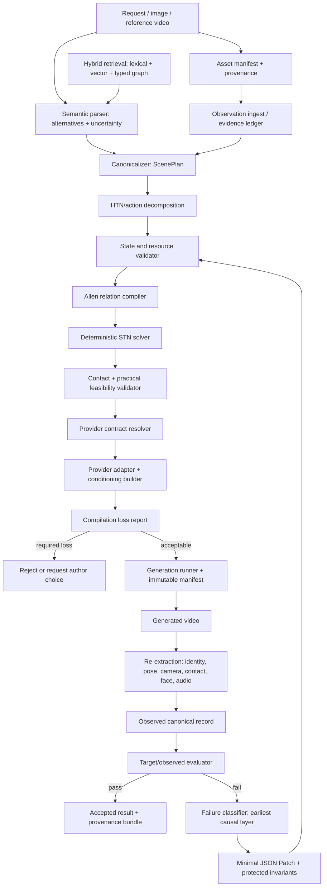

# Director Motion Reasoning System: Repository Gap Audit, Technical Architecture, and Executable Roadmap

**Repository:** `Kingsley-Cyber/ai-video-movement-prompt-system`  
**Audit baseline:** `main` at commit `3db5dcef5f4902ac7343b79a3d9bdae7dc17fc7e` (latest inspected commit dated 2026-07-20)  
**Research/access date:** 2026-07-31  
**Report status:** source-grounded architecture and implementation audit; no repository writes performed  
**Companion artifact:** `dmr_runtime_starter.zip`

## Scope and evidence rules

This report answers the uploaded brief’s operational question: what is required to move the repository from a detailed movement/prompt knowledge system into a measurable, model-aware, self-correcting runtime. Repository inspection preceded conclusions. Provider capabilities were checked against current official documentation, and academic claims were separated into:

- **Established standard:** recognized formalism/specification/method, such as Allen interval algebra, STNs, PROV-O, SHACL, or BML.
- **Research-derived parameterization:** a published computational proxy or learned representation whose validity is bounded by its study and data.
- **Project-specific synthesis:** a CPCS/DMR design choice, including the universal skeleton, seven-phase abstraction, numeric Laban axes, harmonic multi-format compiler, or capability-loss policy.

A schema, runbook, concept card, prompt, or successful-looking render is not treated as proof of an operational subsystem. Repository maturity labels use the brief’s scale: `documented`, `schema_only`, `prototype`, `partially_exercised`, `tested`, `controlled_tested`, and `production_ready`.

Where an exact current capability could not be verified with 100% certainty, this report says so. In particular, Kling’s accessible official product guide is not sufficient to establish an exact public API request contract, and Google’s Veo audio status differs between API surfaces. [E01–E08]

# 1. Executive verdict

## What the repository already does well

The repository is substantially stronger than a normal prompt collection. It has a coherent research corpus, explicit governance, provenance/evidence classes, concept cards, deterministic metadata synchronization, a fourteen-layer motion/directing skeleton, runbooks for reference analysis and format compilation, a real 2D pose extractor, an evidence-merge utility, and a reference YAML-to-canonical-JSON compiler. The frozen MX compiler is especially valuable: it performs safe profile/import resolution, typed merge, schema validation, unresolved-field retention, and compilation reporting. [R01–R20]

The strongest architectural idea is already present: distinguish semantic interpretation from measurable evidence and preserve disagreement rather than averaging it away. The strongest engineering assets are the reference compiler and observation-record tooling. They should be promoted into an executable `lab/runtime/` rather than rewritten from scratch. [R12, R19, R20]

## Why it does not yet “just work”

The repository currently describes most of the desired pipeline but does not execute the causal control plane between authoring and generation. Its flagship combat representation is a sparse authored score, not a solved kinematic plan: it lacks an executable joint hierarchy, coordinate-frame binding, interpolation/reachability guarantees, support-state semantics, temporal consistency solver, provider adapter, or measured round-trip result. [R10, R11]

The evidence ledger contains five qualitative runs. It does not contain repeated generations, exact seeds for every run, linked outputs, blinded ratings, one-variable isolation for most claims, confidence intervals, or a gold benchmark. Therefore labels such as “proven,” “exact,” and “identity-locked” should be interpreted as project shorthand, not controlled empirical findings. [R08, R09]

## Five most important blockers

1. **No authoritative executable canonical runtime:** the repository has rich schemas and views, but no single typed object whose paths are shared by parsing, solving, compilation, evaluation, and repair.
2. **No deterministic temporal/action/state solver:** authored order and timestamps are not checked for contradictions, underconstraint, resource conflicts, support requirements, object ownership, or reaction causality.
3. **No exact provider capability contracts, adapters, and total loss accounting:** current video models do not natively consume most CPCS controls; the system must classify and expose degradation rather than imply execution.
4. **No calibrated extraction/evaluation benchmark:** 2D pose and semantic extraction are insufficient to measure world motion, contact, actor identity, camera motion, continuity, and output adherence.
5. **No closed-loop causal diagnosis and minimal repair:** the repository has a useful human tinkering map, but no evaluator that identifies the earliest responsible layer and applies a bounded patch.

## What kind of problem is it?

The primary deficiency is **missing implementation and controlled evidence**, not missing terminology. Provider limitations are the third major factor: current systems expose useful text/media/rendering controls, but they generally do not expose joint trajectories, contact constraints, FACS curves, Laban vectors, or a symbolic temporal graph as native controls. [E01–E08]

More research documents should not be the next milestone. The next milestone is a small runtime that can reject an inconsistent scene, solve a valid one, compile it through one pinned provider contract, enumerate every loss, and record a reproducible run.
# 2. Repository maturity matrix

| Subsystem | Maturity | Repository evidence | Audit conclusion |
|---|---|---|---|
| Research corpus and terminology | documented | README, research packages, CONCEPT_INDEX | Broad, unusually well organized and provenance-aware. |
| Repository integrity and synchronization | tested | validate_repo.py; sync_repo.py; green gate commit | Tests structural consistency, not motion quality or provider adherence. |
| Concept-card retrieval | partially_exercised | concepts.py; concepts.jsonl | Deterministic token-overlap retrieval works; no vector, temporal, or contradiction retrieval benchmark. |
| Metadata knowledge graph | prototype | build_graph.py; graph.py; graph.json | Useful graph index and traversal; not yet reasoning-grade Graph-RAG. |
| Universal authoring skeleton | schema_only | UNIVERSAL_MOTION_SKELETON.md | Comprehensive field dictionary; multiple authorities and semantics still need consolidation. |
| CPCS-MX canonical schema | prototype | Frozen schemas and compile_authoring_yaml.py | Schema and reference compilation exist; no solved motion or provider execution. |
| Format mixing/compiler doctrine | documented | FORMAT_CONTROL_MAP.md; runbook | Typed-merge laws are sensible project design; format-performance claims are unvalidated. |
| 2D pose extraction | prototype | extract_pose_tier2.py | Executable image-space pose and greedy tracking; no calibrated world motion/contact. |
| Observation evidence merge | prototype | merge_video_observations.py | Preserves hashes/provenance and duplicate conflicts; semantic resolution/evaluation absent. |
| Temporal reasoning runtime | schema_only | Temporal fields in skeleton/examples only | No Allen/STN solver, conflict explanation, or underconstraint detection in lab runtime. |
| Hierarchical action planner | schema_only | Action atoms and phase fields | No executable decomposition, preconditions/effects, or resource semantics. |
| Persistent actor/object state | schema_only | State concepts in research/skeleton | No state transition manager across beats/shots. |
| Contact reasoning | schema_only | Contact records in v005 and skeleton | No contact lifecycle, geometry inference, support semantics, or validator. |
| Biomechanical feasibility | documented | Research discussion and qualitative constraints | No practical validator; no calibrated limits or pass/warn/fail/unknown logic. |
| Provider capability contracts | documented | Concept card and research prose | No model-versioned executable contract under lab/. |
| Provider adapters and loss report | schema_only | Reference compiler reports unresolved fields | No exact API adapter and no total accounting of every canonical control. |
| Generation runner/manifests | documented | Runbook concepts | No reproducible API runner pinning model/version/seed/assets/digests. |
| Output re-extraction | documented | Round-trip runbook | Not exercised on generated results as an evaluation system. |
| Evaluator and benchmark | schema_only | Metric names and five qualitative runs | No gold corpus, calibrated metrics, blinded raters, repeats, or confidence intervals. |
| Failure diagnosis/minimal repair | documented | Tinkering symptom map | No causal classifier or JSON Patch executor. |
| Closed loop | documented | Canonical → generation → re-extraction design | No operational iteration or acceptance-gate enforcement. |
| Production readiness | documented | No production runtime evidence | No subsystem meets production_ready under the brief's definition. |


### Maturity interpretation

- `tested` is reserved for executable behavior with automated checks, not merely schema validation.
- `controlled_tested` requires isolated variables, repeated samples, retained negative results, and uncertainty reporting.
- No subsystem was rated `production_ready`. This is not a criticism of the research quality; it reflects the brief’s operational definition.

The repository’s own runbook supports this conclusion: semantic extraction has been exercised, while the measurement bridge and round-trip verifier are described as unexercised/high-priority work. [R12, R13]
# 3. Gap register

| Gap ID | Gap | Why it matters | Existing support | Missing implementation/research | Data | Tests | Dependencies | Impact | Risk | Priority | Completion criterion |
|---|---|---|---|---|---|---|---|---|---|---|---|
| DMR-G001 | Authoritative runtime object | Without one authority, solvers, adapters, evaluators, and repair patches cannot address stable paths. | Universal skeleton, CPCS-MX schema, VOG schemas. | The repo has several overlapping schemas/views but no single executable, versioned ScenePlan that cleanly separates authored, solved, and observed values. **Required:** Reconcile objects/IDs/units/coordinate frames; define Pydantic/JSON Schema runtime. | Gold canonical examples across domains. | Schema tests; round-trip serialization; no ambiguous authority. | None | Critical | Medium | P0 | One canonical JSON object validates; YAML/XML views are generated; every value carries authority/evidence class. |
| DMR-G002 | Deterministic temporal solver | Action order, reaction latency, contact timing, landing/recovery and camera synchronization cannot be guaranteed or explained. | Temporal fields and runbook prose. | Intervals and phase markers are authored, but no executable consistency engine exists. **Required:** Allen-to-endpoint compiler plus STN solver; negative-cycle explanation; underconstraint detection. | Seeded valid/invalid timelines. | Property tests and gold schedules. | G001 | Critical | Low-medium | P0 | All hard constraints solve or fail with responsible IDs; no silent temporal contradiction. |
| DMR-G003 | Hierarchical action/state semantics | The system cannot detect same-hand conflicts, unsupported kicks, ownership discontinuities or impossible state combinations. | Action atom ontology and phase abstractions. | Action atoms lack executable preconditions, effects, resource locks and interaction protocols. **Required:** HTN/action grammar; precondition/effect/resource model; actor state machine. | Action/state gold traces. | Contradiction fixtures for each required failure case. | G001,G002 | Critical | Medium | P0 | Seeded conflicts are deterministically detected at the earliest causal layer. |
| DMR-G004 | Persistent scene state | Identity, object ownership, screen side, stance, lighting, VFX residue and sound continuity drift. | State concepts in skeleton/research. | State is not preserved as an executable snapshot across beats and shots. **Required:** State snapshots, transition log, invariants, shot handoff contract. | Multi-shot continuity corpus. | Independent-vs-persistent-state A/B tests. | G001,G003 | High | Medium | P0 | Every shot consumes prior state and emits validated next state; illegal discontinuities fail. |
| DMR-G005 | First-class contact graph | Impact, grasp, support, release, near-miss and occluded contact are central to believable motion and repair diagnosis. | v005 contact records and research taxonomy. | Contacts are authored labels rather than a typed lifecycle tied to geometry, support and reaction. **Required:** Typed contact events; actor/target/sites; start/end; confidence; visibility; support; normal; reaction link; cheat policy. | Contact-labeled filmed/synthetic/interaction data. | Contact F1, time error, type accuracy, occlusion strata. | G001,G002,G003 | Critical | High | P0 | Contact lifecycle validates and measured evidence is distinguished from authored cinematic intent. |
| DMR-G006 | Practical feasibility validator | Prompt detail can sound physical while containing impossible support, reach, joint, collision or sequencing states. | Biomechanics research and hard-constraint fields. | The repo names dynamics and support concepts but lacks an executable, bounded validator. **Required:** Pass/warn/fail/unknown checks for support, reach, joint limits, continuity, penetration and root/foot coherence. | Mocap/synthetic ground truth and morphology profiles. | False-pass/false-fail benchmark by check type. | G001,G003,G005 | High | High | P1 | Validator never claims exact forces from monocular video and reports uncertainty explicitly. |
| DMR-G007 | Versioned provider capability contracts | Capabilities differ across products, models and dates; silent inheritance causes invalid requests and false confidence. | Adapter-contract concept card. | Provider support is discussed generically rather than pinned to exact model/API/version/region. **Required:** JSON Schema contracts; lifecycle metadata; exact evidence source; six-way classification. | Official docs snapshots and API smoke tests. | Contract schema tests and drift checks. | G001 | Critical | Medium | P0 | Each production call resolves exactly one verified contract; stale/unknown contract blocks execution. |
| DMR-G008 | Provider adapters | The system cannot actually call a model or choose the right carrier. | Reference YAML compiler and provider prompt templates. | No adapter compiles canonical fields into exact request parameters and conditioning assets. **Required:** One adapter first, then model-specific adapters; dry-run request generation. | Provider fixtures and sandbox calls. | Golden request tests; API schema/smoke tests. | G007 | Critical | Medium-high | P0 | A valid canonical scene produces a reproducible request without manual translation. |
| DMR-G009 | Complete compilation-loss report | The primary objective explicitly forbids silent loss; without total accounting, repair cannot distinguish authoring failure from model limits. | Reference compiler unresolved list and capability report shell. | Unsupported or weakly carried fields can currently be implied or dropped. **Required:** Exactly-once field accounting with classification, carrier, transform, residual risk and required/optional severity. | Canonical fixtures with all control families. | 100% field-coverage assertion; fail-closed tests. | G007,G008 | Critical | Low-medium | P0 | Every requested control appears exactly once; required unsupported/unknown controls fail closed. |
| DMR-G010 | Reproducible generation runner | Results cannot be reproduced, compared, or audited. | Runbook fields and results.csv. | Run records omit key operational artifacts such as exact model, API version, request/response digests, seeds and output links. **Required:** GenerationManifest; request/response hash; asset hashes; task status; costs/latency; output URI. | Provider test account and storage. | Manifest completeness and replay tests. | G008,G009 | High | Medium | P0 | Every output has an immutable manifest and traceable request/asset digests. |
| DMR-G011 | Calibrated extraction stack | Round-trip scoring needs reliable actor identity, world/body/camera motion, hands, face, contact and phase boundaries. | Media manifest/VOG utilities and Tier-2 pose script. | Current executable extraction is 2D pose plus semantic hypotheses. **Required:** Modular tracking, 3D reconstruction, camera solve, hand/face/gaze, optical flow, phase/contact inference with uncertainty. | Mocap, synthetic, controlled film, interactions, stylized clips. | MPJPE, actor swaps, contact F1, phase error, calibration. | G010 | Critical | High | P1 | Each extractor meets predeclared accuracy/calibration bounds on its intended domain. |
| DMR-G012 | Camera-body motion disentanglement | The evaluator can falsely blame actor motion or the compiler can overcorrect body movement. | Research concepts only. | Image-space motion is not separated from camera/lens/crop/edit effects. **Required:** Background/camera solve, world-root reconstruction, lens/crop/edit event estimation. | Camera-ground-truth synthetic/filmed data. | Camera path error and false motion attribution. | G011 | High | High | P1 | Evaluation reports actor and camera residuals separately. |
| DMR-G013 | Structured evaluator | No acceptance gate can be enforced; successful-looking renders substitute for measurement. | Verification plans and metric lists. | Metric names exist, but no implementation compares target canonical records to observed output. **Required:** Target/observed alignment, action/contact/state/camera/identity/style scorers and confidence aggregation. | DMR Bench gold data. | Metric unit tests, human correlation and calibration. | G011,G012,G015 | Critical | High | P1 | Evaluator emits reproducible scores, confidence and evidence locators for every failure. |
| DMR-G014 | Failure taxonomy and causal diagnosis | The loop cannot identify the earliest responsible layer or avoid collateral changes. | RUNBOOK_format_mixing_and_tinkering.md. | The tinkering map links symptoms to fields but is not an executable classifier. **Required:** Typed failure labels; rule/model hybrid classifier; evidence requirements; causal precedence. | Labeled failed generations. | Diagnosis precision/recall and earliest-layer accuracy. | G013 | High | Medium-high | P1 | Failures map to one or more evidence-backed causal candidates with calibrated confidence. |
| DMR-G015 | Minimal repair engine | Regenerating or rewriting the whole prompt obscures causality and creates regressions. | One-field-per-iteration doctrine. | No machine applies constrained patches to canonical paths. **Required:** JSON Patch plans, protected invariants, dependency-aware re-solve/recompile. | Failed scenes with known fixes. | Fields changed, regressions, iterations-to-pass. | G014,G002,G003,G009 | High | Medium | P1 | Repair changes only the earliest responsible fields and reruns all dependent validators. |
| DMR-G016 | DMR benchmark and annotation protocol | No subsystem can progress from prototype to controlled_tested without gold scenes and statistics. | Results ledger and metric ideas. | Five qualitative runs do not establish reliability. **Required:** Fourteen-category benchmark, gold action/temporal/state/contact graphs, provider compilations and outputs. | Licensed/reference assets and human annotators. | Automatic metrics, blind ratings, confidence intervals, negative-result retention. | G001-G015 | Critical | High | P0 | Benchmark release has versioned assets, schemas, annotations, scorer tests and baseline results. |
| DMR-G017 | Statistical experiment harness | Single renders cannot distinguish treatment effects from seed/model variance. | One-lever runbook doctrine. | The repository lacks repeated-condition A/B execution and analysis. **Required:** Experiment manifests, randomized/blinded assignment, repeated generations, CI/effect-size reporting. | Provider budget and benchmark scenes. | Power analysis, bootstrap CI, mixed-effects models where suitable. | G010,G016 | High | Medium | P0 | Every promoted rule has replicated controlled evidence; negative results remain queryable. |
| DMR-G018 | Reasoning-grade hybrid retrieval | An LLM can retrieve terminology while missing the governing constraint, contradiction or provenance path. | Concept cards, metadata graph and paths. | Current token-overlap and BFS graph are not evaluated for DMR questions. **Required:** Lexical+dense+typed graph retrieval; query-aware subgraphs; temporal/contradiction retrieval; reranking. | DMR retrieval QA set. | Node/edge/path/contradiction recall, citation accuracy, faithfulness, token cost. | G016 | Medium-high | Medium-high | P2 | Hybrid retrieval beats token overlap on predeclared metrics and preserves provenance. |
| DMR-G019 | Format doctrine validation | The system may spend tokens or introduce format tax while attributing random variance to a markup language. | p009 and format maps. | JSON/YAML/XML roles are treated as control laws without controlled evidence. **Required:** Semantic-equivalence serializer and controlled format experiments. | Multi-provider repeated generations. | Adherence, schema validity, token overhead, variance and human ratings. | G017 | High | Medium | P0 | No format receives a universal role unless evidence replicates; canonical authority remains independent of view. |
| DMR-G020 | FACS/Laban/Bartenieff calibration | Numbers can look precise while being unreliable as measurements and ignored as generation controls. | FACS/Laban fields and project scales. | Qualitative frameworks are mapped to numeric project controls without calibration to providers. **Required:** Feature definitions, morphology/view normalization, coder reliability, confidence, provider-adherence experiments. | Face/movement corpora and expert coders. | AU metrics, ICC/Krippendorff alpha, proxy error, output adherence. | G011,G016,G017 | Medium | High | P3 | Every numeric scale is labeled standard/research/project-specific and has reliability/adherence evidence. |
| DMR-G021 | Provider lifecycle monitoring | A once-correct adapter can silently become invalid. | No current monitor. | Contracts will drift as models are added, changed and retired. **Required:** Scheduled documentation/API diff, contract expiration, smoke tests and deprecation alerts. | Provider access. | Drift detection and blocked stale-contract tests. | G007,G008 | High | Medium | P1 | Expired or changed contracts cannot execute without reverification. |
| DMR-G022 | Runtime CI and maturity evidence | New runtime code could pass structural validation while breaking solver/compiler semantics. | Existing green integrity gate. | Repository gate checks file consistency but not runtime behavior. **Required:** Unit/property/golden/integration tests wired into validate_repo/CI; maturity evidence manifest. | Test fixtures. | Coverage by failure class and reproducible CI logs. | G001-G010 | High | Low-medium | P0 | A final repository gate runs both structural and runtime tests and records exact evidence. |


## Priority logic

`P0` items establish deterministic truth and reproducibility before expensive generation. `P1` items measure and close the loop. `P2` improves retrieval. `P3` calibrates advanced qualitative frameworks only after a runtime and benchmark exist. This ordering deliberately resists the temptation to perfect FACS/Laban/Bartenieff numeric controls before the system can even prove that a reaction occurs after contact.

# 4. Recommended end-to-end architecture

## Architecture verdict

Use **one authoritative canonical JSON object**, validated by Pydantic/JSON Schema. Let an LLM propose semantic alternatives before serialization, but never let it directly “solve” hard timing, state, ownership, or resource consistency. YAML and XML should be generated authoring/presentation views, not independent authorities. This is a **project-specific synthesis** informed by structured-generation research showing that format compliance and semantic correctness are separate, and that format requirements can impose a model/task-dependent reasoning tax. [E32–E34]



## Component boundaries

### 4.1 Observation ingest and evidence ledger

Inputs are immutable source assets plus records labeled `measured`, `detected`, `inferred`, `interpreted`, or `authored`. The existing source/hash checks and duplicate-conflict preservation should be reused. [R20]

A claim never overwrites its evidence. Resolution creates a new claim that references supporting and contradicting observations. Optional PROV-O export can map plans, activities, agents, derivations, and revisions; do not make RDF a prerequisite for the MVP. **Evidence class: established standard.** [E13]

### 4.2 Semantic parser

The LLM converts natural language into candidate actors, actions, targets, body regions, phases, contacts, camera/edit/VFX events, and ambiguity alternatives. It may propose constraints but cannot mark them solved. It must return:

- stable IDs;
- explicit alternatives when pronouns, actor assignment, target, or order is ambiguous;
- confidence and source span;
- no invented coordinates or model capabilities.

### 4.3 Canonical ScenePlan

Minimum objects:

- `ScenePlan`, `Shot`, `Beat`;
- `Actor`, `Object`, `AssetRef`;
- `Action`, `ActionPhase`, `BodyRegionEvent`;
- `TemporalPoint`, `TemporalConstraint`;
- `StateSnapshot`, `StateTransition`, `ResourceLock`;
- `Contact` and contact lifecycle;
- `CameraEvent`, `EditEvent`, `VFXEvent`, `AudioEvent`;
- `ControlRequest`, `AcceptanceGate`;
- `EvidenceRef`, `ResolvedClaim`, `Contradiction`;
- `CapabilityMapping`, `CompilationLossItem`;
- `GenerationManifest`, `ObservedScene`, `EvaluationReport`, `RepairPatch`.

Every numeric field must declare units and coordinate frame. Every value must declare authority: authored, solved, observed, or derived. Dense arrays remain media/array assets with hashes rather than bloating prompt JSON.

### 4.4 Hierarchical planner

Use an HTN/action grammar for decomposition:

```text
scene → shot → beat → interaction → action → phase → body-region event → effector/joint carrier
```

HTN supplies decomposition and precondition/effect structure; it is not the temporal consistency engine. HDDL is an established representation precedent, but a small typed Python domain is faster for Phase 1. [E12]

### 4.5 State and resource manager

State is event-sourced. Each action reads a snapshot, checks preconditions, locks resources, and emits effects. Required invariants include:

- one effector cannot perform incompatible overlapping actions;
- an object cannot change owner without release/acquire transitions;
- a grasp persists until release;
- a kick requiring one-foot support cannot start before that support is established;
- an airborne actor cannot perform a grounded-only action;
- screen-side changes require a crossing, cut/re-establish, or explicit continuity exception;
- recovery/landing follow the causal action they recover from.

### 4.6 Temporal solver

Allen relations express interval semantics; compile them to start/end time-point inequalities and solve the metric network as an STN. [E09, E10] Details are in Section 5.

### 4.7 Contact and feasibility validator

Contact is a first-class graph, not an adjective in a prompt. The practical feasibility layer returns `pass`, `warning`, `failure`, or `unknown`; it is not a full rigid-body simulator. Research systems demonstrate that contact and world/camera estimation can improve interaction reconstruction, but they remain estimators whose uncertainty must be retained. [E18–E23]

### 4.8 Retrieval layer

Replace the current token-overlap/BFS-only path with a measured hybrid:

1. lexical exact retrieval for terminology and IDs;
2. dense retrieval for paraphrase;
3. typed graph expansion constrained by relation types and time/state scope;
4. contradiction and provenance retrieval;
5. subgraph reranking under a fixed token budget.

GraphRAG and G-Retriever are useful precedents, not proof that this repository’s graph improves prompt quality. Evaluate node, edge, path, contradiction and citation recall on DMR questions. [E30, E31]

### 4.9 Provider contract and adapter

A contract is valid for exactly one `provider + API surface + model/checkpoint + version/date + region/workflow`. The adapter consumes the solved canonical record and emits:

- exact API fields;
- text prompt;
- negative prompt where supported;
- conditioning assets and hashes;
- compilation loss report;
- immutable generation manifest.

### 4.10 Evaluation and repair

Re-extraction creates an **observed canonical record**, never mutates the target. The evaluator aligns target and observed events and reports per-layer residuals. Repair applies a minimal patch to the earliest responsible causal layer, then reruns downstream solving and validation.

## Provenance flow

```text
source asset / request
  → observation or authored claim
  → resolved canonical field
  → solver derivation
  → adapter transform
  → provider request field or loss item
  → generated asset
  → observed measurement
  → score / diagnosis
  → repair patch / new revision
```

Every arrow must be queryable. A final output should be reproducible from the canonical revision, provider contract, request manifest, asset hashes, and model response record.

# 5. Formal temporal-reasoning design

## Recommendation

Use a deterministic **Simple Temporal Network** as the Phase-1 metric solver, with Allen interval relations compiled into endpoint inequalities. Use the action/state layer for causality and resource semantics. Defer STNU until the runtime must dispatch actions online under genuinely uncontrollable durations. **Evidence class: established standard.** [E09–E11]

## Core representation

Each interval `A` has points `A.start` and `A.end`. Every metric rule is:

```text
l ≤ t(right) - t(left) ≤ u
```

Convert it into two difference constraints:

```text
t(right) ≤ t(left) + u
t(left)  ≤ t(right) - l
```

The resulting graph is consistent exactly when it has no negative cycle. Bellman–Ford can detect and explain a negative cycle; all-pairs shortest paths yield implied upper bounds. Relative to origin `Z`:

```text
latest(X)   = D[Z, X]
earliest(X) = -D[X, Z]
```

An infinite side indicates underconstraint.

## Node types

- scene/shot/beat boundary;
- action start/end;
- phase start/apex/end;
- contact begin/apex/end;
- support begin/end;
- grasp/release;
- camera/edit/VFX/audio event;
- observation time with tolerance;
- provider frame-quantized derivative.

## Edge types

- exact or bounded offset;
- duration bound;
- precedence;
- containment;
- coincidence/tolerance;
- synchronization;
- reaction latency;
- persistence-until-release;
- provider quantization relation.

## Allen relation compilation examples

| Relation | Endpoint constraints |
|---|---|
| `A before B` | `B.start - A.end ≥ gap_min` |
| `A meets B` | `B.start - A.end = 0` within tolerance |
| `A overlaps B` | `A.start < B.start < A.end < B.end` encoded with epsilon/bounds |
| `A during B` | `A.start ≥ B.start` and `A.end ≤ B.end` |
| `A starts B` | equal starts; `A.end ≤ B.end` |
| `A finishes B` | equal ends; `A.start ≥ B.start` |
| `A equals B` | equal starts and ends |

The inverse relations are generated, not separately authored.

## Required domain constraints

```text
attack.start < parry.start < attack.apex
contact.start ≈ minimum_distance.time
reaction.start ≥ contact.start + reaction_latency_min
local_compression.start ≤ root_displacement.start
camera_shake.start ≥ contact.start
flight.end ≤ landing.start
recovery.start ≥ landing.end
release.start ≥ grasp.start
support.end ≥ dependent_action.end
```

## Conflict detection and explanation

On a negative cycle, return:

- cycle points;
- originating constraint IDs;
- authored explanations and evidence;
- a small conflict set;
- candidate actions: reject, relax a soft bound, choose an ambiguity branch, or split a shot.

For Phase 1, a deletion-based shrinking pass can reduce the cycle’s constraints to a locally minimal conflict set. Do not let an LLM silently choose which hard constraint to discard.

## Underconstraint detection

Report a point as underconstrained when it lacks a finite lower or upper bound relative to the scene/shot origin. Underconstraint is not always an error: a semantic-text-only camera flourish may remain flexible. It becomes an error when an acceptance gate or provider field needs an exact value.

## Uncertainty representation

Keep three different concepts separate:

1. **Bounded authored tolerance:** an STN interval, such as contact in `[1.95, 2.05]` seconds.
2. **Measurement uncertainty:** observed estimate plus confidence/covariance/evidence locator.
3. **Uncontrollable duration:** an STNU contingent link, only when runtime dispatch semantics exist.

Do not encode low confidence by merely widening a hard planning interval; that conflates epistemic uncertainty with allowed creative variation.

## Example solved timeline

The companion starter solves a blocked turning kick as:

| Event | Solved time |
|---|---:|
| preparation start | 0.50 s |
| support plant end / kick start | 1.30 s |
| defender block start | 1.75 s |
| guard contact start | 2.00 s |
| contact end / reaction start | 2.05 s |
| kick end / recovery start | 2.20 s |
| defender reaction end | 2.55 s |
| attacker recovery end | 3.10 s |
| scene end | 8.00 s |

A contradictory pair such as `A before B by ≥1 s` and `B before A by ≥1 s` is rejected with both responsible constraint IDs. This is implemented and unit-tested in the companion package.

## Serialization

Canonical constraint example:

```json
{
  "constraint_id": "t.reaction.after_contact",
  "left_point": "contact:start",
  "right_point": "reaction:start",
  "min_delta_s": 0.0,
  "max_delta_s": 0.15,
  "hard": true,
  "explanation": "reaction cannot precede contact"
}
```

Frames are a provider/evaluation view. Solve in seconds/source-clock time; quantize only at compilation or comparison, recording rounding loss.
# 6. Provider capability-contract design


## Required classification

Every requested canonical control is exactly one of:

- `native`: documented first-class parameter/control for the exact surface;
- `media-conditioned`: carried by an image, video, audio, pose/depth/control asset;
- `semantic-text-only`: expressed only in prompt semantics;
- `approximated`: translated to another carrier with known loss;
- `unsupported`: official evidence shows no usable carrier for the exact contract;
- `unknown`: accessible evidence is insufficient.

`unsupported` and `unknown` must never be silently omitted. A required control in either class fails closed.

## Contract schema

```json
{
  "contract_id": "provider.surface.model.version-date",
  "provider": "...",
  "api_surface": "...",
  "model_id": "...",
  "contract_kind": "api | product_profile | local_workflow",
  "verified_on": "YYYY-MM-DD",
  "documentation_urls": ["..."],
  "lifecycle": {},
  "mappings": [{
    "canonical_path": "interaction.contacts",
    "classification": "semantic-text-only",
    "carrier": "prompt_text",
    "provider_parameter": null,
    "transform": null,
    "limits": {},
    "evidence_source": "official documentation",
    "notes": "No hard contact channel documented"
  }],
  "unknowns": []
}
```

## Current capability comparison

Legend: `N` native, `M` media-conditioned, `S` semantic-text-only, `A` approximated, `U` unsupported, `?` unknown. Classification is intentionally conservative and pinned to the named exact surface, not the provider brand as a whole. [E01–E08]

| Control | Google Cloud Veo 3.1 Generate | Runway `gen4.5` | BytePlus Seedance 2.0 | Kling VIDEO 3.0 Omni product | LTX-Video pinned local workflow | Sora 2 |
|---|---|---|---|---|---|---|
| Text prompt | N | N | N | N | N | Unavailable |
| Negative prompt | N | Model/route-specific | ? | ? | N/CLI negative prompt | Unavailable |
| Image-to-video / first frame | M | M | M | M | M | Unavailable |
| Last-frame conditioning | M | U for exact gen4.5 | M | M | A via target-frame conditions | Unavailable |
| Multiple reference images | M | A/single image for exact gen4.5 | M (up to documented limit) | M | M at target frames | Unavailable |
| Reference video / video element | U for exact Veo generate input; extension supported | Provider/model-specific | M | M | M | Unavailable |
| Video-to-video/edit | Extension only on exact contract | Other Runway models, not gen4.5 | M/edit/extend | Product supports video elements; API unverified | M via conditioned segments | Unavailable |
| Masks | U/unknown for exact surface | Model-specific | ? | ? | Workflow-specific | Unavailable |
| Pose control | U | U for exact gen4.5 | U | U | M only with pinned pose IC-LoRA/workflow | Unavailable |
| Depth control | U | U for exact gen4.5 | U | U | M only with pinned depth IC-LoRA/workflow | Unavailable |
| Optical-flow control | U | U | U | U | Workflow-specific/unknown | Unavailable |
| Native camera trajectory | S | S | S except camera_fixed parameter | Shot-level semantic control; no verified numeric path | S or conditioning video | Unavailable |
| Keyframes / target frames | First+last only | Model-specific | First+last | Storyboard/product | N target-frame media conditions | Unavailable |
| Multi-shot prompting | S/unsupported as native storyboard | U exact gen4.5; other models differ | S/unknown | N product-level | A through conditions, not native storyboard | Unavailable |
| Seed | N | N | N | ? API unverified | N | Unavailable |
| Duration | N: 4/6/8s | N | N: 4–15s | N: up to 15s product | N via frame count | Unavailable |
| Frame rate / frame count | Fixed 24 FPS; arbitrary count U | Model-specific | Frame count U for exact 2.0 | ? | N frame count; workflow constraints | Unavailable |
| Aspect ratio / resolution | N | N | N | N product controls | N height/width | Unavailable |
| Native audio | U on exact Google Cloud contract; N on Gemini preview contract | U exact gen4.5; provider models differ | N | N | Version/workflow-specific | Unavailable |
| Exact event timestamps | U | U | U | A shot duration only | A target-frame conditioning | Unavailable |
| Contact constraints | S | S | S/M via reference media | S/M via reference media | A via rendered control media | Unavailable |
| Joint trajectories | U | U | U | U | A via rendered pose; symbolic arrays not native | Unavailable |
| FACS numeric tracks | S | S | S | S | S/M via reference media | Unavailable |
| Laban numeric tracks | S | S | S | S | S/M via motion reference | Unavailable |
| Identity binding | M reference assets; no hard guarantee | M first image; no hard guarantee | M multi-reference | M elements/references product claims | M multiple conditions | Unavailable |
| Extension / continuation | N | Provider/model-specific | M | Product-level/unknown API | M conditioned continuation | Unavailable |


## Model-specific findings

### Google Cloud `veo-3.1-generate-001`

Official current documentation lists text/image input, text-to-video, image-to-video, first-and-last-frame generation, extension, asset reference images, 4/6/8-second outputs, 9:16 and 16:9, 24 FPS, and 720p/1080p/4K output. The exact page marks sound generation unsupported. [E01]

The Gemini API preview page separately documents Veo 3.1 output video with audio. Therefore “Veo 3.1 supports audio” is not a valid unqualified contract statement; the API surface must be pinned. [E02]

### Runway `gen4.5`

Runway exposes separate text-to-video, image-to-video, and video-to-video endpoints plus a rapidly changing model catalog. The July 30, 2026 changelog states that older Gen-3 Alpha Turbo and Gen-4 Aleph identifiers are no longer available and recommends Gen-4.5/Gen-4 Turbo/Aleph 2 replacements. Capabilities from Seedance, Veo, Gemini Omni, or Aleph 2 routed through Runway must not be inherited by the exact `gen4.5` contract. [E03, E04]

### BytePlus Seedance 2.0

Official ModelArk documentation describes multimodal reference input, including multiple images/videos/audio, first/last-frame roles, duration, aspect ratio, resolution, seed, camera-fixed, audio generation, editing and extension. The exact request nesting is JavaScript-rendered and should be verified against the API Explorer before production. Legacy parameters embedded in prompt text must not be treated as equivalent to top-level API parameters. [E05]

### Kling VIDEO 3.0 Omni

The official product guide documents text/image generation, first/end frames, multi-image/element/video references, native audio, multi-shot, up to 15 seconds, and shot-level duration/framing/angle/camera-movement semantics. This supports a `product_profile`, not a verified API adapter. Exact API parameter names could not be verified with 100% certainty from accessible official documentation. [E06]

### LTX-Video

The official model card documents local image-to-video and multiple image/video conditions placed at target frame numbers with strength, frame count, resolution and seed. Pose/depth/canny control is checkpoint/workflow-specific; the listed pose/depth IC-LoRA checkpoints must not be generalized to all LTX versions. [E07]

### Sora 2

OpenAI’s official system card says the product is no longer available as of April 26, 2026. No current operational public adapter should be implemented from historical product claims. [E08]

## Compilation-loss report

Every `ControlRequest` produces one row:

```json
{
  "control_id": "ctrl.contact.001",
  "canonical_path": "interaction.contacts",
  "requested_value": {"time_s": 2.0, "sites": ["right_foot", "left_forearm"]},
  "required": false,
  "classification": "semantic-text-only",
  "carrier": "prompt_text",
  "provider_parameter": null,
  "compiled_value": "Contact at 2.00 s ...",
  "residual_risk": "No hard contact or exact timestamp guarantee",
  "evidence_source": "pinned contract source"
}
```

Contract completion gate:

```text
count(loss_report rows) == count(control requests)
AND each control_id occurs exactly once
AND required unsupported/unknown count == 0
```

Provider-side successful submission is not proof of semantic adherence; it proves only request validity.

# 7. Director Motion Reasoning Benchmark

## Benchmark structure

Create `DMR-Bench` with fourteen required categories:

1. natural locomotion;
2. gesture/dialogue;
3. face/gaze;
4. two-person interaction;
5. screen combat;
6. product demonstration;
7. human-object interaction;
8. camera-subject coordination;
9. anime/stylized action;
10. VFX-enhanced action;
11. multi-shot continuity;
12. prompt compression;
13. model-capability degradation;
14. failure diagnosis and repair.

External suites such as VBench and T2V-CompBench provide useful generic quality/compositional precedents, but they do not replace gold action, temporal, state, contact, camera and repair records. [E28, E29]

## Per-scene package

```text
scene_id/
├── request.md
├── assets/ + SHA256SUMS
├── observations.jsonl
├── gold.scene.json
├── gold.temporal.json
├── gold.state_trace.jsonl
├── gold.contacts.json
├── provider_compilations/
├── expected_loss_reports/
├── generations/<provider-contract>/<condition>/<replicate>/
├── observed/
├── scores/
├── human_ratings/
└── failure_labels/
```

## Annotation protocol

- Two independent annotators plus adjudication for action/phase/contact/state labels.
- Expert coders only where FACS/LMA expertise is required.
- Annotators see source-clock video, frame index, actor IDs, coordinate frame and uncertainty tools.
- Every label records visibility, confidence and evidence span.
- Ambiguity is represented as alternatives; annotators are not forced to fabricate one truth.
- Report inter-rater agreement per label family, not one global number.

Suggested statistics:

- categorical labels: Cohen/Fleiss kappa or Krippendorff alpha;
- continuous times/trajectories: ICC and absolute error;
- interval boundaries: tolerance-aware F1 and mean boundary error;
- LMA: dimension-level reliability, preserving the literature’s warning that agreement varies. [E17]

## Automatic metrics

| Layer | Metrics |
|---|---|
| actor/identity | actor-swap count, IDF1, face/body embedding drift |
| pose/world motion | MPJPE/PA-MPJPE where valid, root trajectory error, orientation error |
| contact/support | foot-contact F1, hand-object/contact F1, contact-time error, support violation, foot-skate distance |
| temporal/causal | action-order accuracy, phase-boundary error, reaction-latency error, temporal-constraint satisfaction |
| geometry | reach violation, penetration, joint discontinuity, root/foot coherence |
| camera | camera path error, subject-scale error, horizon/axis continuity, shake onset error |
| editing | cut/shot-order accuracy, duration error, continuity violations |
| identity/state | ownership errors, screen-side flips, wardrobe/light/VFX residue changes |
| prompt/capability | requested-control coverage, loss severity, provider request validity, semantic adherence |
| repair | iterations to pass, fields changed, collateral regressions, cost/time to pass |

World-grounded motion and contact-aware research demonstrates relevant estimator designs, but the benchmark must measure their error on this project’s domains, including stylized/anime material. [E18–E23]

## Human ratings

Five-point anchored rubrics:

- action correctness;
- causal coherence;
- contact readability;
- weight/grounding;
- identity continuity;
- camera/directing adherence;
- style realization;
- visible artifact severity;
- overall acceptance.

Raters are blinded to condition and prompt format. Randomize presentation and include duplicate items to measure rater consistency.

## Controlled A/B methodology

- same exact provider contract and model version;
- same assets and duration;
- same seed where supported, plus multiple seeds to estimate variance;
- one changed variable;
- at least 8–20 replicates per condition depending variance/cost;
- predeclared primary metric and decision rule;
- bootstrap confidence intervals/effect sizes;
- negative and null results retained;
- no promotion from one successful render.

## Initial acceptance thresholds

These are **project-specific provisional thresholds**, to be calibrated:

- temporal hard-constraint satisfaction: `100%` on canonical solver fixtures;
- required-control accounting: `100%`;
- action-order accuracy: `≥0.95` for benchmark scenes before auto-repair;
- actor swaps: `0` for two-actor short scenes;
- contact-time median absolute error: `≤0.15 s` before contact-triggered repair;
- foot-contact F1: `≥0.90` on calibrated domains before support repair;
- diagnosis precision: `≥0.85` for auto-patching a causal layer;
- human inter-rater reliability: threshold set per metric; no aggregate claim if a dimension is unreliable;
- automatic repair only when extractor confidence and metric calibration both pass.

The thresholds must be revised from pilot data; they are not industry standards.

# 8. Round-trip verification and minimal repair

## Closed-loop stages

```text
1. Canonical target revision
2. Deterministic solve and validation
3. Provider-contract compilation
4. Generation manifest and output
5. Re-extraction to observed canonical record
6. Target/observed alignment
7. Layered scoring with confidence
8. Failure classification
9. Earliest-causal-layer patch
10. Re-solve, revalidate, recompile, regenerate
```

## Extraction stage

Use modular extractors and retain their raw outputs:

- shot/cut and presentation timestamp normalization;
- person detection/tracking and re-identification;
- 2D/3D body, hands, face, head/gaze;
- camera motion and world/root reconstruction;
- optical flow and motion segmentation;
- contact/support inference;
- action/phase segmentation;
- audio transients, speech timing and synchronization;
- VFX/particles/flash/shake/smear cues.

The current MediaPipe extractor can remain a fallback/fast lane, but its greedy centroid tracking must not be treated as reliable multi-person identity through crossings or occlusion. [R16]

Research systems such as PHALP, 4DHumans and WHAM provide stronger precedents for tracking/world motion; contact-aware systems provide interaction priors. They still require domain calibration and cannot eliminate monocular ambiguity. [E18–E23]

## Comparison stage

Align by source-clock seconds, then compute:

- event matching by actor/action/type;
- interval intersection and boundary errors;
- dynamic time warping only where trajectory alignment is appropriate;
- contact graph matching with tolerance and visibility;
- state trace differences;
- camera/body-separated residuals;
- identity/state continuity violations;
- style and perceptual scores kept separate from physical plausibility.

Do not collapse all metrics into one score before diagnosis. A visually strong result can be temporally wrong, and a physically coherent result can miss style.

## Failure classification

| Observed failure | Earliest likely causal layer | Minimum patch candidate |
|---|---|---|
| wrong action order | temporal graph | change/add precedence or interval bound |
| defender reacts before impact | contact/temporal | constrain reaction after contact; verify contact ID |
| same hand holds object and attacks | action/state resource | change effector, release object, or serialize actions |
| kick begins before support plant | state/support | insert/extend support contact; shift action start |
| foot sliding | support/root feasibility | lock support interval; reduce root drift; add pose carrier |
| weak impact but correct contact | performance/perceptual compiler | anticipation, contact pose, reaction lag, camera/audio/VFX timing |
| penetration | geometry/contact | alter target distance/contact pose or split shot |
| identity swap | provider/conditioning or shot complexity | strengthen references, split shot, reduce crossings |
| screen-side flip | persistent state/camera axis | add crossing/re-establish event or axis lock |
| ignored numeric control | capability/serialization | classify unsupported/semantic-only; switch carrier or drop requirement |
| camera motion mistaken for actor motion | extraction | rerun camera solve; block body repair |
| style failure with correct action | style transform | patch style fields only; protect action/temporal invariants |

## Patch format

Use RFC 6902-style JSON Patch plus dependencies and protected invariants:

```json
{
  "patch_id": "repair.004",
  "diagnosis": "REACTION_BEFORE_CONTACT",
  "confidence": 0.93,
  "operations": [
    {"op": "replace", "path": "/temporal_constraints/17/min_delta_s", "value": 0.04}
  ],
  "protected_paths": [
    "/actors",
    "/contacts/0/sites",
    "/style_profile"
  ],
  "requires_resolve": true,
  "requires_recompile": true
}
```

The repair engine must reject patches that violate protected invariants or create a new solver conflict.

## Automation gate

Automatic repair is permitted only when:

```text
extractor calibrated for domain
AND evaluator confidence ≥ threshold
AND diagnosis precision validated
AND patch targets a whitelisted path family
AND no required provider loss is introduced
```

Otherwise, generate an operator-facing diagnosis and alternatives rather than an automatic mutation.

# 9. Research agenda

## Must research immediately — only what blocks Phase 1/2

1. Exact reconciliation between CPCS-MX frozen schema, VOG records and the new runtime object.
2. Provider contract fields for the first chosen API, including smoke-test behavior and lifecycle.
3. Temporal/action/contact benchmark annotation rules and tolerances.
4. A practical support/contact/feasibility validator that clearly distinguishes deterministic, estimated, qualitative and unknown values.
5. Extraction backend selection and calibration plan for the first benchmark domains.

## Research after the runtime exists

- camera/body/world-motion estimator comparison;
- contact inference across human-human, human-object and stylized video;
- retrieval query planning and learned subgraph retrieval;
- provider-specific prompt compression and control-carrier selection;
- minimal repair classifier and confidence calibration;
- motion tokens or learned structured descriptions;
- STNU only if online dispatch/uncertain duration semantics become real requirements.

## Low-value or premature work

- expanding terminology without executable consumers;
- declaring universal superiority for JSON/YAML/XML;
- adding more provider prompt templates without a contract schema and tests;
- building a full physics simulator before support/contact/state checks exist;
- numeric Bartenieff or Laban controls before coder reliability and provider adherence tests;
- sophisticated learned graph retrievers before a DMR retrieval QA benchmark;
- multi-agent orchestration before each agent has deterministic interfaces and acceptance gates.

## Topics already sufficiently covered for implementation to begin

- broad FACS/Laban/Bartenieff/directing/cinematography terminology;
- provenance/evidence-class doctrine;
- need to separate semantic and measurement lanes;
- high-level canonical layer coverage;
- typed merge/profile concept;
- one-variable experiment principle;
- need for provider capability degradation and round-trip verification.

The repository has enough conceptual coverage to begin runtime implementation now. [R01–R20]

# 10. Implementation roadmap with observable completion tests

## Phase 1 — Minimum functioning runtime

### Deliverables

- canonical `ScenePlan` Pydantic model and JSON Schema;
- action phases, state preconditions/effects and resource locks;
- typed contact records;
- deterministic STN solver and conflict explanations;
- basic feasibility/state/contact validator;
- promoted MX merge/compiler utilities;
- one exact provider API contract and dry-run adapter;
- total compilation-loss report;
- CLI and runtime unit tests.

### Observable completion tests

```text
[PASS] 100% of canonical fixtures validate or fail with exact path errors.
[PASS] Every seeded temporal contradiction returns responsible constraint IDs.
[PASS] Every required failure case in the brief is detected.
[PASS] Every ControlRequest appears exactly once in the loss report.
[PASS] Required unsupported/unknown controls block execution.
[PASS] A valid scene generates a deterministic provider request and asset manifest.
[PASS] No network call is required for dry-run tests.
[PASS] Repository structural gate remains green after integration.
```

The companion starter already demonstrates the first executable slice: twelve tests cover STN solve/conflict/underconstraint, effector conflicts, premature reaction, exact request-body list paths, contract-limit rejection, non-executable product profiles, complete loss accounting and fail-closed compilation.

## Phase 2 — Measurement and verification

### Deliverables

- immutable generation manifests and provider smoke tests;
- modular extraction pipeline;
- actor identity/re-ID, pose, camera/body separation, contact/phase inference;
- DMR-Bench v0.1 with controlled filmed/synthetic/reference scenes;
- target/observed alignment and metric library;
- human-rating and inter-rater workflow.

### Observable completion tests

```text
[PASS] Every output is traceable to model/version/request/assets/digests.
[PASS] Extractor metrics meet predeclared bounds on held-out gold data.
[PASS] Camera and actor residuals are reported separately.
[PASS] Contact and phase metrics are calibrated by visibility/domain strata.
[PASS] Benchmark scorers reproduce baseline results from immutable manifests.
```

## Phase 3 — Closed-loop repair

### Deliverables

- failure taxonomy and labeled corpus;
- earliest-causal-layer diagnosis;
- constrained JSON Patch repair;
- protected invariants and dependency re-solving;
- automatic regeneration loop with iteration/cost caps.

### Observable completion tests

```text
[PASS] Diagnosis precision/recall meets thresholds on held-out failures.
[PASS] Repair changes fewer fields than full rewrite and reduces collateral regressions.
[PASS] Every patch triggers required downstream solve/validate/compile stages.
[PASS] Loop halts on pass, unrepairable capability loss, confidence failure or budget cap.
```

## Phase 4 — Advanced reasoning

### Deliverables

- calibrated FACS/Laban/Bartenieff proxies;
- hybrid Graph-RAG retrieval planner and DMR QA benchmark;
- learned motion/pose tokens where they add measurable value;
- additional provider adapters and carrier-selection optimization;
- style/perceptual compensation policy learned from controlled evidence.

### Observable completion tests

```text
[PASS] Numeric controls have derivation, normalization, reliability and provider-adherence evidence.
[PASS] Hybrid retrieval improves node/edge/path/contradiction recall and answer faithfulness.
[PASS] Learned representations beat deterministic features on predeclared metrics.
[PASS] New adapters pass the same contract/loss/manifest conformance suite.
```

# 11. Exact repository changes recommended

Keep `research/` frozen. Add implementation under `lab/`:

```text
lab/
├── runtime/
│   ├── __init__.py
│   ├── cli.py
│   ├── models/
│   │   ├── scene.py
│   │   ├── action.py
│   │   ├── state.py
│   │   ├── contact.py
│   │   ├── provenance.py
│   │   └── capability.py
│   ├── solvers/
│   │   ├── stn.py
│   │   ├── allen_compile.py
│   │   └── conflict_explain.py
│   ├── validators/
│   │   ├── semantic.py
│   │   ├── state_resources.py
│   │   ├── contact.py
│   │   └── feasibility.py
│   ├── compiler/
│   │   ├── canonicalize.py
│   │   ├── prompt_render.py
│   │   ├── loss_report.py
│   │   └── conditioning_assets.py
│   ├── adapters/
│   │   ├── base.py
│   │   ├── google_veo_3_1.py
│   │   └── contracts/
│   ├── generation/
│   │   ├── manifest.py
│   │   └── runner.py
│   ├── evaluators/
│   │   ├── align.py
│   │   ├── temporal.py
│   │   ├── contact.py
│   │   ├── identity.py
│   │   ├── camera.py
│   │   └── aggregate.py
│   └── repair/
│       ├── taxonomy.py
│       ├── diagnose.py
│       └── patch.py
├── schema/
│   ├── scene_plan.schema.json
│   ├── provider_capability_contract.schema.json
│   ├── compilation_result.schema.json
│   ├── generation_manifest.schema.json
│   ├── evaluation_report.schema.json
│   └── repair_patch.schema.json
├── benchmarks/
│   └── dmr_bench/
│       ├── README.md
│       ├── annotation_guidelines.md
│       ├── scenes/
│       ├── scorers/
│       └── baselines/
├── experiments/
│   ├── queue.csv
│   ├── manifests/
│   └── analysis/
└── tests/
    └── runtime/
        ├── test_stn.py
        ├── test_state.py
        ├── test_contact.py
        ├── test_contracts.py
        ├── test_compiler.py
        └── fixtures/
```

## File responsibilities and interfaces

| File/module | Responsibility | Input | Output |
|---|---|---|---|
| `models/scene.py` | authoritative runtime root | parsed/authored data | validated ScenePlan |
| `solvers/stn.py` | metric temporal consistency | temporal constraints | schedule/bounds/conflict |
| `solvers/allen_compile.py` | interval relation lowering | Allen relation | endpoint constraints |
| `validators/state_resources.py` | preconditions/effects/resource locks | ScenePlan + schedule | issues + state trace |
| `validators/contact.py` | contact lifecycle and evidence checks | contacts + tracks | pass/warn/fail/unknown |
| `adapters/base.py` | contract interface | canonical + contract | request/loss items |
| `compiler/loss_report.py` | exactly-once accounting | control requests + mappings | complete loss report |
| `generation/manifest.py` | reproducibility | request/assets/response | immutable manifest |
| `evaluators/align.py` | target/observed matching | target + observed | correspondences |
| `repair/patch.py` | bounded mutation | diagnosis + invariants | JSON Patch + dependency plan |

## Existing assets to promote, not duplicate

- typed merge, import safety, schema validation and unresolved reporting from the frozen MX compiler; [R19]
- evidence record/source-hash checks and observation merge from CPCS v1.2; [R20]
- 2D pose fast lane from `extract_pose_tier2.py`; [R16]
- concept IDs and graph metadata for retrieval experiments; [R17, R18]
- repository synchronization/integrity gate; [R15]

After integration, extend `validate_repo.py` to run runtime tests and contract/schema validation. Preserve its explicit distinction between repository integrity and output quality.

# 12. Controlled experiment queue

The complete 22-experiment queue is included in the companion package at `experiments/experiment_queue.csv`. The required first fifteen are present, plus seed-variance, extraction-calibration, retrieval, camera-disentanglement and contact-scoring studies.

## Execution order

1. `E003` temporal solver vs unsolved timeline;
2. `E012` provider adapter vs generic prompt;
3. `E017` loss severity vs observed failure;
4. `E018` seed variance;
5. `E001/E002` prose/CNL and JSON/YAML/XML equivalence;
6. `E004/E005` contact/support controls;
7. `E007/E014/E015` endpoint/identity/state continuity;
8. `E019/E021/E022` extraction, camera and contact calibration;
9. `E013` repair loop;
10. FACS/Laban only after automatic/human measurement is reliable.

## Non-negotiable experiment rules

- no format comparison unless semantic content is mechanically equivalent;
- no “same seed” claim when a provider does not expose or honor seed;
- no cross-model comparison presented as a prompt-format effect;
- no automatic metric promoted without human-correlation and calibration evidence;
- no rule added to the production compiler from one render;
- all null/negative results remain in the run ledger.

# 13. Non-negotiable conclusions tested

| Claim | Current verdict | Evidence class | Required next evidence |
|---|---|---|---|
| JSON improves choreography | Unsupported as a universal claim | Project-specific hypothesis | semantic-equivalent, repeated, multi-model A/B |
| XML improves timing | Unsupported as a universal claim | Project-specific hypothesis | same as above plus timing metrics |
| YAML improves intent adherence | Unsupported as a universal claim | Project-specific hypothesis | same as above |
| More numerical detail improves generation | Conditional/model-specific; can be ignored or impose token/format cost | Project-specific hypothesis informed by structured-output research | density sweep and capability-loss analysis |
| A video model understands joint coordinates | Unsupported for inspected provider surfaces | Current provider evidence | exact native API control or media-carrier experiment |
| Camera tricks compensate for invalid biomechanics | Can improve perception or concealment, but cannot make motion physically correct | Project-specific perceptual compiler | physical and human-perception metrics reported separately |
| Laban numeric vectors control movement quality | Unvalidated project parameterization | Project-specific synthesis; research proxies exist | feature derivation, coder reliability, provider-adherence A/B |
| FACS AU tracks improve facial performance | Unvalidated as provider control; useful as extraction/annotation representation | Established FACS concepts + research extraction | AU reliability and provider-specific generation experiment |
| Seven phases generalize across domains | Project-specific abstraction, not established universal standard | Project-specific synthesis | cross-domain annotation coverage/error study |
| Graph-RAG improves prompt quality | Not established for this repository | Research precedent for retrieval | DMR retrieval and downstream prompt/adherence benchmark |
| One successful render proves a control method | False | Experimental-method principle | repeated controlled generations with uncertainty |
| An LLM can judge fine-grained motion accurately | Not established without calibration | Open research/measurement question | gold video set, human correlation, confidence calibration |
| Re-extraction is sufficient for automatic repair | Not yet established | Research agenda | per-metric error bounds and repair safety evaluation |

Structured-output research supports separating reasoning from packaging and measuring schema validity separately from semantic correctness. It does not prove that one markup language carries intrinsic directing intelligence. [E32–E34]

# 14. Direct answer to the final question

> **What is the minimum technically defensible system that should be built next?**

Build a **single-scene, single-provider, fail-closed Director Motion Runtime** with these executable boundaries:

1. one authoritative typed `ScenePlan` with actors, actions, phases, state, contacts, camera events, evidence and control requests;
2. HTN/action decomposition plus deterministic state/resource checks;
3. Allen-relation lowering into an STN solver that reports conflicts and underconstraint;
4. a bounded contact/support/feasibility validator that returns pass/warn/fail/unknown;
5. one exact, dated provider capability contract and adapter;
6. an exactly-once compilation-loss report that blocks required unsupported/unknown controls;
7. an immutable generation manifest;
8. a small gold benchmark with repeated generations and manual scoring.

Do **not** begin with a universal multi-provider compiler, learned motion tokens, numeric Laban/Bartenieff calibration, or autonomous repair. First prove that the system can reject a contradictory blocked kick, solve a valid one, compile it honestly to one model, reproduce the request, and measure whether action order/contact/identity/camera matched.

That system is small enough to implement and test, but it changes the repository’s nature: from a sophisticated knowledge and authoring framework into an executable control plane. The companion `dmr_runtime_starter` implements the first deterministic slice and provides provider-contract examples, schemas, tests, a solved scene, a compilation result and the experiment queue.
# 15. Source matrix

All web sources were accessed on **2026-07-31**. Repository sources are pinned to the audited commit.

| ID | Domain | Authors/organization | Title | Year | Source type | Review/status | URL/DOI | Concepts supported | Reliability | Limitations | Cited sections |
|---|---|---|---:|---|---|---|---|---|---|---|---|
| R01 | Repository root | Kingsley-Cyber | README.md | 2026 | Repository file | Project artifact | https://github.com/Kingsley-Cyber/ai-video-movement-prompt-system/blob/3db5dcef5f4902ac7343b79a3d9bdae7dc17fc7e/README.md | Root purpose and prose-compilation position | High for repository state | Does not prove runtime behavior | 1,2 |
| R02 | Repository governance | Kingsley-Cyber | AGENTS.md | 2026 | Repository file | Project artifact | https://github.com/Kingsley-Cyber/ai-video-movement-prompt-system/blob/3db5dcef5f4902ac7343b79a3d9bdae7dc17fc7e/AGENTS.md | Frozen research rule, validation discipline | High | Process rules, not output evidence | 1,10,11 |
| R03 | Agent skill | Kingsley-Cyber | SKILL.md | 2026 | Repository file | Project artifact | https://github.com/Kingsley-Cyber/ai-video-movement-prompt-system/blob/3db5dcef5f4902ac7343b79a3d9bdae7dc17fc7e/SKILL.md | Structured score compiles to model-consumable prose | High | Conflicts with later lab doctrine | 1,3,9 |
| R04 | Lab governance | Kingsley-Cyber | lab/AGENTS.md | 2026 | Repository file | Project artifact | https://github.com/Kingsley-Cyber/ai-video-movement-prompt-system/blob/3db5dcef5f4902ac7343b79a3d9bdae7dc17fc7e/lab/AGENTS.md | Lab rules and format doctrine | High | Contains project claims not yet experimentally established | 1,2,9 |
| R05 | Control mapping | Kingsley-Cyber | lab/CONTROL_SURFACE.md | 2026 | Repository file | Project artifact | https://github.com/Kingsley-Cyber/ai-video-movement-prompt-system/blob/3db5dcef5f4902ac7343b79a3d9bdae7dc17fc7e/lab/CONTROL_SURFACE.md | Declared controls and statuses | High for declarations | Status labels exceed available run evidence in places | 1,2,3 |
| R06 | Format doctrine | Kingsley-Cyber | lab/FORMAT_CONTROL_MAP.md | 2026 | Repository file | Project artifact | https://github.com/Kingsley-Cyber/ai-video-movement-prompt-system/blob/3db5dcef5f4902ac7343b79a3d9bdae7dc17fc7e/lab/FORMAT_CONTROL_MAP.md | YAML/JSON/XML role assignment | High for project design | Not controlled evidence of model behavior | 3,9,12 |
| R07 | Canonical skeleton | Kingsley-Cyber | lab/UNIVERSAL_MOTION_SKELETON.md | 2026 | Repository file | Project artifact | https://github.com/Kingsley-Cyber/ai-video-movement-prompt-system/blob/3db5dcef5f4902ac7343b79a3d9bdae7dc17fc7e/lab/UNIVERSAL_MOTION_SKELETON.md | Fourteen-layer authoring schema | High for coverage | Declarative; not a solver or provider adapter | 2,4,5 |
| R08 | Registry | Kingsley-Cyber | lab/registry.yaml | 2026 | Repository file | Project artifact | https://github.com/Kingsley-Cyber/ai-video-movement-prompt-system/blob/3db5dcef5f4902ac7343b79a3d9bdae7dc17fc7e/lab/registry.yaml | Variants, patterns, hypotheses | High | Several statuses are qualitative/project-specific | 1,2,12 |
| R09 | Run ledger | Kingsley-Cyber | lab/runs/results.csv | 2026 | Repository data | Project artifact | https://github.com/Kingsley-Cyber/ai-video-movement-prompt-system/blob/3db5dcef5f4902ac7343b79a3d9bdae7dc17fc7e/lab/runs/results.csv | Five qualitative runs | High | No repeated seeds, linked outputs, blinded ratings, or confidence intervals | 1,2,7 |
| R10 | Combat canonical | Kingsley-Cyber | lab/variants/v005_combat_kinematic_json.jsonc | 2026 | Repository example | Project artifact | https://github.com/Kingsley-Cyber/ai-video-movement-prompt-system/blob/3db5dcef5f4902ac7343b79a3d9bdae7dc17fc7e/lab/variants/v005_combat_kinematic_json.jsonc | Sparse authored endpoints, contacts, Laban, metrics | High | Not a solved dense kinematic trajectory | 1,2,5 |
| R11 | Combat authoring | Kingsley-Cyber | lab/variants/v005_combat_full_authoring.md | 2026 | Repository example | Project artifact | https://github.com/Kingsley-Cyber/ai-video-movement-prompt-system/blob/3db5dcef5f4902ac7343b79a3d9bdae7dc17fc7e/lab/variants/v005_combat_full_authoring.md | Full authoring package | High | Single qualitative validation comment | 1,2,12 |
| R12 | Reference pipeline | Kingsley-Cyber | lab/RUNBOOK_reference_to_kinematic_truth.md | 2026 | Repository runbook | Project artifact | https://github.com/Kingsley-Cyber/ai-video-movement-prompt-system/blob/3db5dcef5f4902ac7343b79a3d9bdae7dc17fc7e/lab/RUNBOOK_reference_to_kinematic_truth.md | Tiered extraction and round-trip plan | High | Explicitly marks measurement bridge and round-trip as unexercised | 1,8,9 |
| R13 | Semantic extraction | Kingsley-Cyber | lab/RUNBOOK_pegasus_extraction.md | 2026 | Repository runbook | Project artifact | https://github.com/Kingsley-Cyber/ai-video-movement-prompt-system/blob/3db5dcef5f4902ac7343b79a3d9bdae7dc17fc7e/lab/RUNBOOK_pegasus_extraction.md | Pegasus semantic lane | High | Semantic interpretation is not frame-accurate measurement | 2,8 |
| R14 | Format compiler design | Kingsley-Cyber | lab/RUNBOOK_format_mixing_and_tinkering.md | 2026 | Repository runbook | Project artifact | https://github.com/Kingsley-Cyber/ai-video-movement-prompt-system/blob/3db5dcef5f4902ac7343b79a3d9bdae7dc17fc7e/lab/RUNBOOK_format_mixing_and_tinkering.md | Typed merge and symptom-field map | High | Design specification, not runtime evidence | 3,9,12 |
| R15 | Integrity validator | Kingsley-Cyber | lab/scripts/validate_repo.py | 2026 | Repository code | Project artifact | https://github.com/Kingsley-Cyber/ai-video-movement-prompt-system/blob/3db5dcef5f4902ac7343b79a3d9bdae7dc17fc7e/lab/scripts/validate_repo.py | Repository integrity gate | High | Explicitly not an output-quality validator | 2,10 |
| R16 | Pose extractor | Kingsley-Cyber | lab/scripts/extract_pose_tier2.py | 2026 | Repository code | Project artifact | https://github.com/Kingsley-Cyber/ai-video-movement-prompt-system/blob/3db5dcef5f4902ac7343b79a3d9bdae7dc17fc7e/lab/scripts/extract_pose_tier2.py | MediaPipe 2D extraction and greedy tracking | High | No world reconstruction, camera solve, contact, or robust re-ID | 2,8 |
| R17 | Concept retrieval | Kingsley-Cyber | lab/scripts/concepts.py | 2026 | Repository code | Project artifact | https://github.com/Kingsley-Cyber/ai-video-movement-prompt-system/blob/3db5dcef5f4902ac7343b79a3d9bdae7dc17fc7e/lab/scripts/concepts.py | Weighted token-overlap retrieval | High | Not embedding retrieval or Graph-RAG query planning | 2,4,9 |
| R18 | Metadata graph | Kingsley-Cyber | lab/scripts/build_graph.py and graph.py | 2026 | Repository code | Project artifact | https://github.com/Kingsley-Cyber/ai-video-movement-prompt-system/tree/3db5dcef5f4902ac7343b79a3d9bdae7dc17fc7e/lab/scripts | Deterministic graph build, BFS/path/walk | High | No learned retrieval, contradiction search, temporal query, or retrieval benchmark | 2,4,9 |
| R19 | MX reference compiler | Kingsley-Cyber | research/CPCS_MX_Hierarchical_Motion_Grammar_Research_Package_v1.0/scripts/compile_authoring_yaml.py | 2026 | Repository code | Project artifact | https://github.com/Kingsley-Cyber/ai-video-movement-prompt-system/blob/3db5dcef5f4902ac7343b79a3d9bdae7dc17fc7e/research/CPCS_MX_Hierarchical_Motion_Grammar_Research_Package_v1.0/scripts/compile_authoring_yaml.py | Typed merge, safe imports, schema validation, unresolved reporting | High | Explicitly no dense synthesis, constraint solve, or provider compilation | 1,2,4,10 |
| R20 | Observation graph merge | Kingsley-Cyber | research/CPCS_FACS_Laban_AI_Video_Research_Package_v1.2/scripts/merge_video_observations.py | 2026 | Repository code | Project artifact | https://github.com/Kingsley-Cyber/ai-video-movement-prompt-system/blob/3db5dcef5f4902ac7343b79a3d9bdae7dc17fc7e/research/CPCS_FACS_Laban_AI_Video_Research_Package_v1.2/scripts/merge_video_observations.py | Evidence merge, source/hash checking, duplicate conflict retention | High | Does not resolve semantic contradictions or compare generated output to target | 2,8 |
| E01 | Video provider | Google Cloud | Veo 3.1 model documentation | 2026 | Official documentation | Official/current | https://docs.cloud.google.com/gemini-enterprise-agent-platform/models/veo/3-1-generate | Exact model IDs, inputs, first/last frame, references, extension, durations, FPS, resolution, audio status | High | Specific to this Google Cloud surface; audio differs elsewhere | 3,6 |
| E02 | Video provider | Google | Veo 3.1 — Gemini API | 2026 | Official documentation | Official/current | https://ai.google.dev/gemini-api/docs/models/veo-3.1-generate-preview | Gemini API preview model and video-with-audio surface | High | Preview; not interchangeable with Vertex/Agent Platform contract | 3,6 |
| E03 | Video provider | Runway | Runway API Reference | 2026 | Official documentation | Official/current | https://docs.dev.runwayml.com/api/ | Text/image/video endpoints and request surfaces | High | Capabilities differ by routed model | 3,6 |
| E04 | Video provider | Runway | API Changelog & Updates | 2026 | Official changelog | Official/current | https://docs.dev.runwayml.com/api-details/api_changelog/ | Model lifecycle and July 2026 changes | High | Rapidly changing; must be pinned by date | 3,6 |
| E05 | Video provider | BytePlus | ModelArk Video Generation API | 2026 | Official API documentation | Official/current | https://docs.byteplus.com/en/docs/modelark/1520757 | Seedance 2 multimodal references and top-level generation parameters | High | JavaScript-rendered details should be verified in API Explorer | 3,6 |
| E06 | Video provider | Kling AI | Kling VIDEO 3.0 Omni Guide | 2026 | Official product guide | Official/current | https://kling.ai/quickstart/klingai-video-3-omni-model-user-guide | Product-level multi-reference, multi-shot, audio, duration and shot controls | Medium-high | Accessible source does not establish exact API request schema | 3,6 |
| E07 | Video provider | Lightricks | LTX-Video Model Card | 2026 | Official model card/repository | Official technical artifact | https://huggingface.co/Lightricks/LTX-Video | Local inference, frame-indexed image/video conditions, version-specific pose/depth checkpoints | High | Capabilities vary by checkpoint and workflow | 3,6 |
| E08 | Video provider | OpenAI | Sora 2 System Card | 2025; updated note 2026 | Official system card | Official | https://openai.com/index/sora-2-system-card/ | Sora 2 description and product discontinuation note | High | No current operational public provider adapter | 3,6 |
| E09 | Temporal reasoning | James F. Allen | Maintaining Knowledge about Temporal Intervals | 1983 | Journal article | Peer-reviewed | https://doi.org/10.1145/182.358434 | Interval relations and constraint propagation | High | Qualitative interval algebra alone does not provide metric scheduling | 5 |
| E10 | Temporal reasoning | Rina Dechter; Itay Meiri; Judea Pearl | Temporal Constraint Networks | 1991 | Journal article | Peer-reviewed | https://doi.org/10.1016/0004-3702(91)90006-6 | STP/TCSP metric time-point constraints and polynomial STP solving | High | Disjunctions move beyond simple STN tractability | 5 |
| E11 | Temporal uncertainty | Paul Morris; Nicola Muscettola; Thierry Vidal | Dynamic Control of Plans with Temporal Uncertainty | 2001 | NASA technical paper | Primary institutional | https://ntrs.nasa.gov/citations/20010091013 | STNU controllability and execution under uncontrollable durations | High | Premature for an authored-video MVP without active dispatch | 5,9 |
| E12 | Hierarchical planning | Daniel Höller et al. | HDDL: An Extension to PDDL for Expressing Hierarchical Planning Problems | 2020 | AAAI conference paper | Peer-reviewed | https://doi.org/10.1609/aaai.v34i06.6542 | HTN representation and common hierarchical planning language | High | Planning language is not itself a temporal consistency solver | 4,5 |
| E13 | Provenance | W3C Provenance Working Group | PROV-O: The PROV Ontology | 2013 | W3C Recommendation | Established standard | https://www.w3.org/TR/prov-o/ | Entity/activity/agent provenance interchange | High | RDF/OWL export need not be the MVP runtime store | 4 |
| E14 | Graph validation | W3C RDF Data Shapes Working Group | Shapes Constraint Language (SHACL) | 2017 | W3C Recommendation | Established standard | https://www.w3.org/TR/shacl/ | RDF graph validation and severity | High | Applies to RDF graphs; JSON/Pydantic is simpler for MVP runtime | 4,9 |
| E15 | Behavior representation | Stefan Kopp et al. | Towards a Common Framework for Multimodal Generation: The Behavior Markup Language | 2006 | IVA conference paper | Peer-reviewed | https://doi.org/10.1007/11821830_17 | Intent planning → behavior planning → behavior realization separation | High | Designed for embodied agents, not modern video-model native control | 4 |
| E16 | Facial analysis | Tadas Baltrušaitis et al. | OpenFace 2.0: Facial Behavior Analysis Toolkit | 2018 | IEEE FG paper | Peer-reviewed | https://doi.org/10.1109/FG.2018.00019 | AU, gaze, head pose and landmark extraction | High | Accuracy depends on view, identity, occlusion and AU | 8,9 |
| E17 | Laban reliability | Ulysses Bernardet et al. | Assessing the reliability of the Laban Movement Analysis system | 2019 | PLOS ONE article | Peer-reviewed | https://doi.org/10.1371/journal.pone.0218179 | Empirical expert-coder LMA reliability | High | Reliability varies; does not validate project [-1,1] provider controls | 9 |
| E18 | World motion | Soyong Shin et al. | WHAM: Reconstructing World-grounded Humans with Accurate 3D Motion | 2024 | CVPR paper | Peer-reviewed | https://openaccess.thecvf.com/content/CVPR2024/html/Shin_WHAM_Reconstructing_World-grounded_Humans_with_Accurate_3D_Motion_CVPR_2024_paper.html | World-coordinate motion, camera angular velocity, contact-aware trajectory refinement | High | Still an estimator with domain and occlusion limits | 8 |
| E19 | Human tracking | Shubham Goel et al. | Humans in 4D: Reconstructing and Tracking Humans with Transformers | 2023 | ICCV paper | Peer-reviewed | https://openaccess.thecvf.com/content/ICCV2023/html/Goel_Humans_in_4D_Reconstructing_and_Tracking_Humans_with_Transformers_ICCV_2023_paper.html | Multi-person 3D reconstruction/tracking through occlusion | High | Identity and fast-motion errors remain possible | 8 |
| E20 | Human tracking | Jiefeng Li et al. | PHALP: A Deep Learning Framework for Long-term Human Motion Prediction and Tracking | 2022 | CVPR paper | Peer-reviewed | https://openaccess.thecvf.com/content/CVPR2022/html/Rajasegaran_Tracking_People_by_Predicting_3D_Appearance_Location_and_Pose_CVPR_2022_paper.html | 3D appearance/location/pose tracking | High | Not a complete interaction or contact model | 8 |
| E21 | Human-object contact | Jiahao Wang et al. | CONTHO: 3D Human-Object Reconstruction with Contact Refinement | 2024 | CVPR paper | Peer-reviewed | https://openaccess.thecvf.com/content/CVPR2024/html/Wang_CONTHO_3D_Human-Object_Reconstruction_with_Contact_Refinement_CVPR_2024_paper.html | Contact-guided human-object reconstruction | High | Dataset and object assumptions limit generalization | 8 |
| E22 | Human-human interaction | Zhihao Xu et al. | Inter-X: Towards Versatile Human-Human Interaction Analysis | 2024 | CVPR paper/dataset | Peer-reviewed | https://openaccess.thecvf.com/content/CVPR2024/html/Xu_Inter-X_Towards_Versatile_Human-Human_Interaction_Analysis_CVPR_2024_paper.html | Body/hand interaction data and language annotations | High | Dataset coverage does not prove arbitrary stylized combat extraction | 7,8 |
| E23 | Reactive interaction | Yiming Zhang et al. | ReGenNet: Towards Human Action-Reaction Synthesis | 2024 | CVPR paper | Peer-reviewed | https://openaccess.thecvf.com/content/CVPR2024/html/Zhang_ReGenNet_Towards_Human_Action-Reaction_Synthesis_CVPR_2024_paper.html | Actor/reactor causal motion generation | High | Research model, not provider interface | 8 |
| E24 | Multi-person object interaction | Yun Liu; Chengwen Zhang; Ruofan Xing; Bingda Tang; Bowen Yang; Li Yi | CORE4D: A 4D Human-Object-Human Interaction Dataset for Collaborative Object REarrangement | 2025 | CVPR paper/dataset | Peer-reviewed | https://openaccess.thecvf.com/content/CVPR2025/html/Liu_CORE4D_A_4D_Human-Object-Human_Interaction_Dataset_for_Collaborative_Object_REarrangement_CVPR_2025_paper.html | Human-object-human interaction annotation precedent | High | Collaborative rearrangement scope does not cover arbitrary combat or cinematic interaction | 7,8 |
| E25 | Motion-language representation | Biao Jiang; Xin Chen; Wen Liu; Jingyi Yu; Gang Yu; Tao Chen | MotionGPT: Human Motion as a Foreign Language | 2023 | NeurIPS paper | Peer-reviewed | https://proceedings.neurips.cc/paper_files/paper/2023/hash/3fbf0c1ea0716c03dea93bb6be78dd6f-Abstract-Conference.html | Discrete motion tokens and language modeling | High | Learned tokens are not interpretable hard controls and are advanced-phase work | 8,9 |
| E26 | Motion-language dataset | Chuan Guo et al. | Generating Diverse and Natural 3D Human Motions from Text | 2022 | CVPR paper / HumanML3D | Peer-reviewed | https://openaccess.thecvf.com/content/CVPR2022/html/Guo_Generating_Diverse_and_Natural_3D_Human_Motions_From_Text_CVPR_2022_paper.html | Text-motion corpus and evaluation baseline | High | Single-person locomotion/action emphasis | 7,8 |
| E27 | Deterministic pose descriptions | David Delmas et al. | PoseScript: 3D Human Poses from Natural Language | 2022 | ECCV paper | Peer-reviewed | https://arxiv.org/abs/2210.11795 | Deterministic posecodes between keypoints and text | High | Static pose representation does not solve temporal interactions | 8 |
| E28 | Video evaluation | Ziqi Huang et al. | VBench: Comprehensive Benchmark Suite for Video Generative Models | 2024 | CVPR paper | Peer-reviewed | https://openaccess.thecvf.com/content/CVPR2024/html/Huang_VBench_Comprehensive_Benchmark_Suite_for_Video_Generative_Models_CVPR_2024_paper.html | Hierarchical video-generation quality dimensions | High | Does not contain DMR-specific gold action/contact graphs | 7 |
| E29 | Compositional video evaluation | Kaiyue Sun; Kaiyi Huang; Xian Liu; Yue Wu; Zihan Xu; Zhenguo Li; Xihui Liu | T2V-CompBench: A Comprehensive Benchmark for Compositional Text-to-video Generation | 2025 | CVPR paper | Peer-reviewed | https://openaccess.thecvf.com/content/CVPR2025/html/Sun_T2V-CompBench_A_Comprehensive_Benchmark_for_Compositional_Text-to-video_Generation_CVPR_2025_paper.html | Attribute, spatial, motion, action and interaction evaluation precedent | High | Benchmark still lacks DMR temporal-solver, contact-graph and repair-loop focus | 7 |
| E30 | Graph RAG | Darren Edge et al. | From Local to Global: A Graph RAG Approach to Query-Focused Summarization | 2024 | Technical report/preprint | Research report | https://arxiv.org/abs/2404.16130 | Entity graph and community-summary retrieval for global questions | High for reported scope | Does not establish DMR prompt-quality gains | 4,9 |
| E31 | Graph retrieval | Xiaoxin He et al. | G-Retriever: Retrieval-Augmented Generation for Textual Graph Understanding and Question Answering | 2024 | NeurIPS paper | Peer-reviewed | https://papers.nips.cc/paper_files/paper/2024/hash/efaf1c9726648c8ba363a5c927440529-Abstract-Conference.html | Query-conditioned subgraph retrieval and GraphQA | High | Requires DMR-specific benchmark adaptation | 4,9 |
| E32 | Structured generation | Ivan Yee Lee; Loris D'Antoni; Taylor Berg-Kirkpatrick | The Format Tax | 2026 | Preprint | Not yet peer-reviewed | https://arxiv.org/abs/2604.03616 | Reasoning degradation from format instructions and late-formatting remedy | Medium-high | Model/task dependent; not specifically video prompting | 3,9 |
| E33 | Structured generation | Saibo Geng et al. | Generating Structured Outputs from Language Models: Benchmark and Studies (JSONSchemaBench) | 2025 | Preprint/benchmark | Not yet peer-reviewed | https://arxiv.org/abs/2501.10868 | Schema compliance, coverage, efficiency and output quality separation | Medium-high | Does not test motion semantics or provider video adherence | 3,7 |
| E34 | Structured generation | Jialin Yang et al. | StructEval: Benchmarking LLMs' Capabilities to Generate Structural Outputs | 2025 | Preprint/benchmark | Not yet peer-reviewed | https://arxiv.org/abs/2505.20139 | 18 formats, 44 task types and structural-fidelity gaps | Medium-high | Format generation benchmark, not causal choreography evidence | 3,7 |


## Source-quality caveats

- Provider capability claims are current only for the exact surfaces and dates shown.
- The official Kling product guide supports product-level claims but not a fully verified API request schema.
- Some 2025/2026 structured-output works are preprints and are used as evidence to test format assumptions, not as settled standards.
- Research motion/contact systems establish feasible computational approaches, not guaranteed performance on fast combat, anime, severe occlusion, or generated video.
